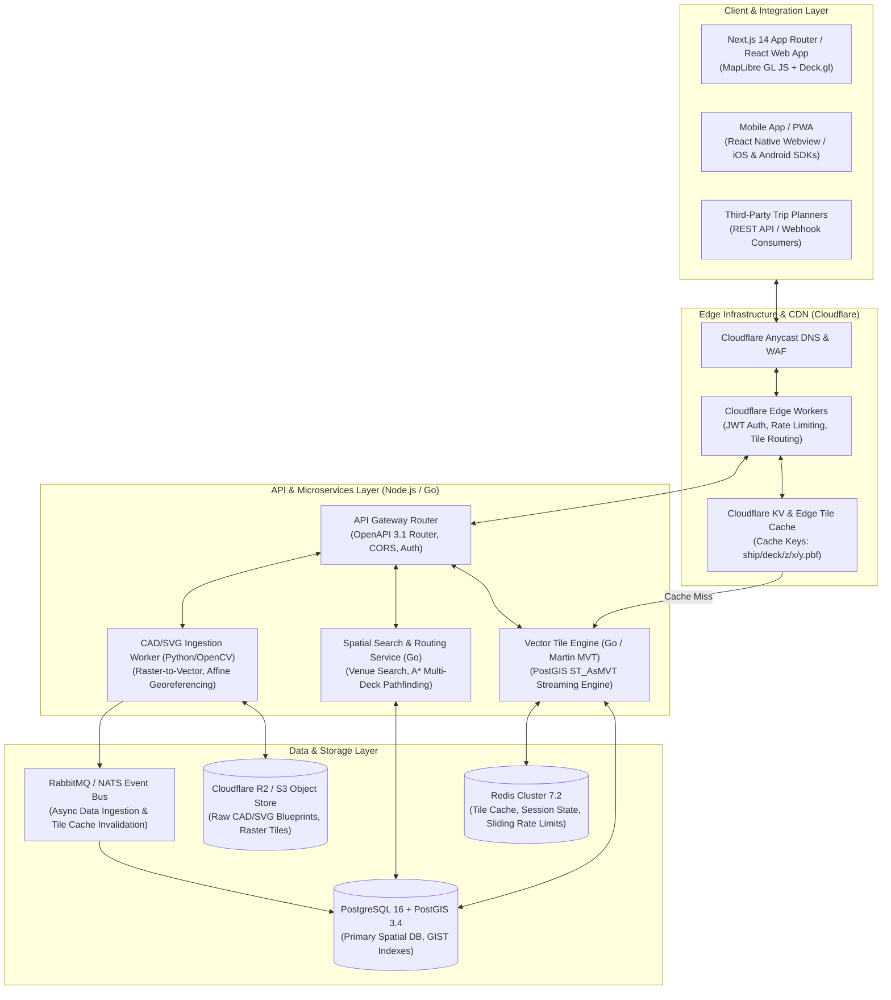
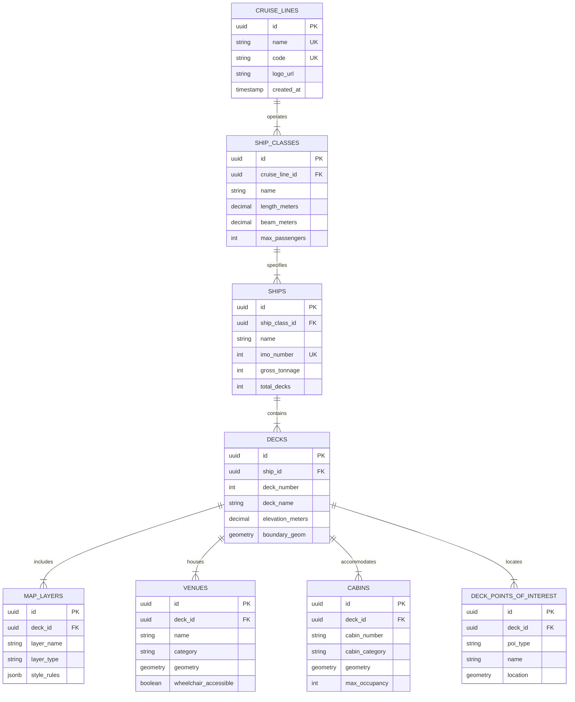
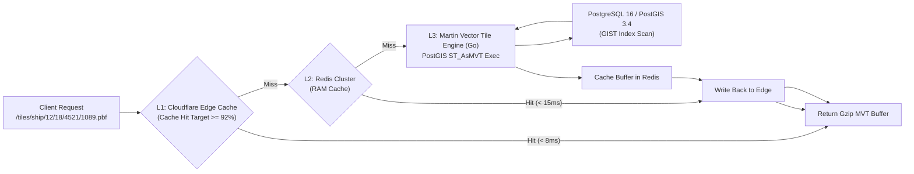

# Open-Source Cruise Ship Deck Plan & Map Platform
## System Architecture, Spatial Database Schema & Scaling Blueprint

> **Document Version:** 1.0.0  
> **Status:** Approved Architecture Baseline  
> **Maintainer:** Core Infrastructure & Spatial Systems Architecture Team  

---

## 1. System Architecture & Component Overview

The Cruise Ship Deck Plan & Map Platform is engineered as a high-performance geospatial platform organized in a **Turborepo Monorepo Architecture**. It seamlessly delivers real-time multi-deck rendering, sub-50ms vector tile streaming, spatial search, and trip-planning route optimization to millions of concurrent web and mobile clients.

### 1.1 High-Level Architectural Topology



### 1.2 Monorepo Project Structure & Responsibilities

```
cruise-ship-maps/
├── apps/
│   ├── web/                        # Next.js 14 Web Map Viewer & Portal
│   ├── annotator/                  # Community Deck Vector Editor & Moderation Portal
│   └── docs/                       # Developer Portal & Interactive OpenAPI Specs
├── packages/
│   ├── core-geojson/               # Cruise Deck GeoJSON Extension v1.0 Types & Schemas
│   ├── tile-server/                # High-speed MVT Tile Generation Library (Go/Node)
│   ├── spatial-routing/            # Multi-deck pathfinding engine (A* / Dijkstra)
│   └── sdk-ts/                     # Official TypeScript/JS SDK for Developers
├── services/
│   ├── api-gateway/                # Edge API Router & Rate Limiter
│   ├── ingestion-worker/           # CAD/SVG/Raster Data Extraction & Polygonization
│   └── tile-service/               # Martin/Tegola Vector Tile Microservice
├── docs/
│   ├── scrum/                      # Agile Framework, DoD & Product Backlog
│   └── architecture/               # Architecture Diagrams, Specs & Schemas
└── docker/                         # Docker Compose & Kubernetes Deployment Manifests
```

---

## 2. Spatial Database Schema & PostGIS DDL

The core spatial data is maintained within PostgreSQL 16 with PostGIS 3.4. All spatial geometries use **EPSG:4326** (WGS 84 coordinate system with `[longitude, latitude]` order) for persistent storage, with runtime transformation to **EPSG:3857** (Web Mercator) during Mapbox Vector Tile generation.



### 2.1 Complete PostGIS DDL Script (`001_initial_spatial_schema.sql`)

```sql
-- Enable PostGIS & UUID extensions
CREATE EXTENSION IF NOT EXISTS "postgis";
CREATE EXTENSION IF NOT EXISTS "uuid-ossp";

-- 1. CRUISE LINES TABLE
CREATE TABLE cruise_lines (
    id UUID PRIMARY KEY DEFAULT uuid_generate_v4(),
    name VARCHAR(255) NOT NULL UNIQUE,
    code VARCHAR(10) NOT NULL UNIQUE,
    headquarters_country VARCHAR(100),
    website_url VARCHAR(500),
    logo_url VARCHAR(500),
    created_at TIMESTAMPTZ NOT NULL DEFAULT CURRENT_TIMESTAMP,
    updated_at TIMESTAMPTZ NOT NULL DEFAULT CURRENT_TIMESTAMP
);

-- 2. SHIP CLASSES TABLE
CREATE TABLE ship_classes (
    id UUID PRIMARY KEY DEFAULT uuid_generate_v4(),
    cruise_line_id UUID NOT NULL REFERENCES cruise_lines(id) ON DELETE CASCADE,
    name VARCHAR(255) NOT NULL,
    length_meters NUMERIC(6,2) CHECK (length_meters > 0),
    beam_meters NUMERIC(5,2) CHECK (beam_meters > 0),
    gross_tonnage INT CHECK (gross_tonnage > 0),
    max_passengers INT CHECK (max_passengers > 0),
    created_at TIMESTAMPTZ NOT NULL DEFAULT CURRENT_TIMESTAMP,
    updated_at TIMESTAMPTZ NOT NULL DEFAULT CURRENT_TIMESTAMP,
    CONSTRAINT idx_ship_classes_line_name UNIQUE (cruise_line_id, name)
);

-- 3. SHIPS TABLE
CREATE TABLE ships (
    id UUID PRIMARY KEY DEFAULT uuid_generate_v4(),
    ship_class_id UUID NOT NULL REFERENCES ship_classes(id) ON DELETE RESTRICT,
    name VARCHAR(255) NOT NULL,
    imo_number INT UNIQUE CHECK (imo_number BETWEEN 1000000 AND 9999999),
    build_year INT CHECK (build_year >= 1900),
    total_decks INT NOT NULL CHECK (total_decks > 0),
    created_at TIMESTAMPTZ NOT NULL DEFAULT CURRENT_TIMESTAMP,
    updated_at TIMESTAMPTZ NOT NULL DEFAULT CURRENT_TIMESTAMP
);

-- 4. DECKS TABLE
CREATE TABLE decks (
    id UUID PRIMARY KEY DEFAULT uuid_generate_v4(),
    ship_id UUID NOT NULL REFERENCES ships(id) ON DELETE CASCADE,
    deck_number INT NOT NULL CHECK (deck_number >= 0),
    deck_name VARCHAR(100) NOT NULL,
    elevation_meters NUMERIC(5,2) NOT NULL DEFAULT 0.00,
    z_index INT NOT NULL DEFAULT 0,
    boundary_geometry GEOMETRY(Polygon, 4326),
    created_at TIMESTAMPTZ NOT NULL DEFAULT CURRENT_TIMESTAMP,
    updated_at TIMESTAMPTZ NOT NULL DEFAULT CURRENT_TIMESTAMP,
    CONSTRAINT idx_decks_ship_number UNIQUE (ship_id, deck_number)
);

-- 5. VENUES TABLE
CREATE TABLE venues (
    id UUID PRIMARY KEY DEFAULT uuid_generate_v4(),
    deck_id UUID NOT NULL REFERENCES decks(id) ON DELETE CASCADE,
    name VARCHAR(255) NOT NULL,
    category VARCHAR(100) NOT NULL CHECK (category IN (
        'dining', 'bar_lounge', 'entertainment', 'pool_deck', 
        'wellness_spa', 'shopping', 'casino', 'kids_club', 
        'guest_services', 'outdoor_recreation', 'navigation_bridge'
    )),
    description TEXT,
    opening_hours JSONB,
    wheelchair_accessible BOOLEAN NOT NULL DEFAULT TRUE,
    requires_reservation BOOLEAN NOT NULL DEFAULT FALSE,
    geometry GEOMETRY(Polygon, 4326) NOT NULL,
    created_at TIMESTAMPTZ NOT NULL DEFAULT CURRENT_TIMESTAMP,
    updated_at TIMESTAMPTZ NOT NULL DEFAULT CURRENT_TIMESTAMP
);

-- 6. CABINS TABLE
CREATE TABLE cabins (
    id UUID PRIMARY KEY DEFAULT uuid_generate_v4(),
    deck_id UUID NOT NULL REFERENCES decks(id) ON DELETE CASCADE,
    cabin_number VARCHAR(20) NOT NULL,
    cabin_category_code VARCHAR(20) NOT NULL,
    cabin_type VARCHAR(50) NOT NULL CHECK (cabin_type IN (
        'interior', 'oceanview', 'balcony', 'suite', 'accessible_suite'
    )),
    max_occupancy INT NOT NULL DEFAULT 2 CHECK (max_occupancy > 0),
    has_balcony BOOLEAN NOT NULL DEFAULT FALSE,
    wheelchair_accessible BOOLEAN NOT NULL DEFAULT FALSE,
    connecting_cabin_number VARCHAR(20),
    geometry GEOMETRY(Polygon, 4326) NOT NULL,
    created_at TIMESTAMPTZ NOT NULL DEFAULT CURRENT_TIMESTAMP,
    updated_at TIMESTAMPTZ NOT NULL DEFAULT CURRENT_TIMESTAMP,
    CONSTRAINT idx_cabins_deck_number UNIQUE (deck_id, cabin_number)
);

-- 7. MAP LAYERS TABLE
CREATE TABLE map_layers (
    id UUID PRIMARY KEY DEFAULT uuid_generate_v4(),
    deck_id UUID NOT NULL REFERENCES decks(id) ON DELETE CASCADE,
    layer_name VARCHAR(100) NOT NULL,
    layer_type VARCHAR(50) NOT NULL CHECK (layer_type IN (
        'bulkheads', 'corridors', 'stairs', 'elevators', 'safety_equipment', 'zones'
    )),
    geometry GEOMETRY(Geometry, 4326) NOT NULL,
    style_rules JSONB NOT NULL DEFAULT '{}'::jsonb,
    min_zoom INT NOT NULL DEFAULT 14 CHECK (min_zoom BETWEEN 0 AND 24),
    max_zoom INT NOT NULL DEFAULT 22 CHECK (max_zoom BETWEEN 0 AND 24),
    created_at TIMESTAMPTZ NOT NULL DEFAULT CURRENT_TIMESTAMP,
    updated_at TIMESTAMPTZ NOT NULL DEFAULT CURRENT_TIMESTAMP
);

-- 8. DECK POINTS OF INTEREST (POIs) TABLE
CREATE TABLE deck_points_of_interest (
    id UUID PRIMARY KEY DEFAULT uuid_generate_v4(),
    deck_id UUID NOT NULL REFERENCES decks(id) ON DELETE CASCADE,
    name VARCHAR(255) NOT NULL,
    poi_type VARCHAR(100) NOT NULL CHECK (poi_type IN (
        'elevator_bank', 'staircase', 'restroom_accessible', 'restroom_standard',
        'muster_station', 'defibrillator_aed', 'atm', 'towel_station', 'excursion_desk'
    )),
    location GEOMETRY(Point, 4326) NOT NULL,
    metadata JSONB NOT NULL DEFAULT '{}'::jsonb,
    created_at TIMESTAMPTZ NOT NULL DEFAULT CURRENT_TIMESTAMP,
    updated_at TIMESTAMPTZ NOT NULL DEFAULT CURRENT_TIMESTAMP
);

-- ============================================================================
-- SPATIAL AND B-TREE INDEXING STRATEGY
-- ============================================================================

-- Spatial Indexes (GIST)
CREATE INDEX idx_decks_boundary_geom_gist ON decks USING GIST (boundary_geometry);
CREATE INDEX idx_venues_geometry_gist ON venues USING GIST (geometry);
CREATE INDEX idx_cabins_geometry_gist ON cabins USING GIST (geometry);
CREATE INDEX idx_map_layers_geometry_gist ON map_layers USING GIST (geometry);
CREATE INDEX idx_pois_location_gist ON deck_points_of_interest USING GIST (location);

-- B-Tree Indexes for Key Lookups
CREATE INDEX idx_ships_imo ON ships(imo_number);
CREATE INDEX idx_decks_ship_id_deck_num ON decks(ship_id, deck_number);
CREATE INDEX idx_venues_deck_category ON venues(deck_id, category);
CREATE INDEX idx_cabins_deck_type ON cabins(deck_id, cabin_type);
CREATE INDEX idx_pois_deck_type ON deck_points_of_interest(deck_id, poi_type);

-- Triggers for Automatic Updated_At Timestamping
CREATE OR REPLACE FUNCTION update_timestamp_column()
RETURNS TRIGGER AS $$
BEGIN
   NEW.updated_at = NOW();
   RETURN NEW;
END;
$$ language 'plpgsql';

CREATE TRIGGER trg_update_cruise_lines BEFORE UPDATE ON cruise_lines FOR EACH ROW EXECUTE PROCEDURE update_timestamp_column();
CREATE TRIGGER trg_update_ship_classes BEFORE UPDATE ON ship_classes FOR EACH ROW EXECUTE PROCEDURE update_timestamp_column();
CREATE TRIGGER trg_update_ships BEFORE UPDATE ON ships FOR EACH ROW EXECUTE PROCEDURE update_timestamp_column();
CREATE TRIGGER trg_update_decks BEFORE UPDATE ON decks FOR EACH ROW EXECUTE PROCEDURE update_timestamp_column();
CREATE TRIGGER trg_update_venues BEFORE UPDATE ON venues FOR EACH ROW EXECUTE PROCEDURE update_timestamp_column();
CREATE TRIGGER trg_update_cabins BEFORE UPDATE ON cabins FOR EACH ROW EXECUTE PROCEDURE update_timestamp_column();
CREATE TRIGGER trg_update_map_layers BEFORE UPDATE ON map_layers FOR EACH ROW EXECUTE PROCEDURE update_timestamp_column();
CREATE TRIGGER trg_update_pois BEFORE UPDATE ON deck_points_of_interest FOR EACH ROW EXECUTE PROCEDURE update_timestamp_column();
```

---

## 3. Custom Cruise Deck GeoJSON Extension v1.0 Specification

The platform standardizes all deck features using an extended GeoJSON format (`deck_geojson_v1.schema.json`) based on RFC 7946.

### 3.1 JSON Schema Definition

```json
{
  "$schema": "https://json-schema.org/draft/2020-12/schema",
  "$id": "https://schema.cruiseshipmaps.org/v1/deck_geojson_v1.schema.json",
  "title": "Cruise Deck GeoJSON Extension v1.0",
  "description": "Standardized spatial FeatureCollection schema for cruise ship deck plans.",
  "type": "object",
  "required": ["type", "ship_id", "deck_number", "deck_name", "elevation_meters", "z_index", "features"],
  "properties": {
    "type": {
      "type": "string",
      "const": "FeatureCollection"
    },
    "ship_id": {
      "type": "string",
      "format": "uuid"
    },
    "deck_number": {
      "type": "integer",
      "minimum": 0
    },
    "deck_name": {
      "type": "string"
    },
    "elevation_meters": {
      "type": "number"
    },
    "z_index": {
      "type": "integer"
    },
    "crs": {
      "type": "object",
      "properties": {
        "type": { "type": "string", "const": "name" },
        "properties": {
          "type": "object",
          "properties": {
            "name": { "type": "string", "const": "urn:ogc:def:crs:OGC:1.3:CRS84" }
          }
        }
      }
    },
    "features": {
      "type": "array",
      "items": {
        "$ref": "#/$defs/DeckFeature"
      }
    }
  },
  "$defs": {
    "DeckFeature": {
      "type": "object",
      "required": ["type", "id", "geometry", "properties"],
      "properties": {
        "type": { "type": "string", "const": "Feature" },
        "id": { "type": "string", "format": "uuid" },
        "geometry": {
          "type": "object",
          "required": ["type", "coordinates"],
          "properties": {
            "type": { "type": "string", "enum": ["Point", "LineString", "Polygon", "MultiPolygon"] },
            "coordinates": { "type": "array" }
          }
        },
        "properties": {
          "type": "object",
          "required": ["feature_type", "name", "wheelchair_accessible"],
          "properties": {
            "feature_type": {
              "type": "string",
              "enum": ["venue", "cabin", "corridor", "stairwell", "elevator", "muster_station", "poi"]
            },
            "category": { "type": "string" },
            "name": { "type": "string" },
            "description": { "type": "string" },
            "wheelchair_accessible": { "type": "boolean" },
            "tactile_warning": { "type": "boolean" },
            "opening_hours": { "type": "object" },
            "cabin_metadata": {
              "type": "object",
              "properties": {
                "cabin_number": { "type": "string" },
                "cabin_type": { "type": "string" },
                "max_occupancy": { "type": "integer" },
                "has_balcony": { "type": "boolean" }
              }
            }
          }
        }
      }
    }
  }
}
```

---

## 4. OpenAPI 3.1 Specification

The API is fully documented under the **OpenAPI 3.1.0** standard for consumption by external trip planning systems.

```json
{
  "openapi": "3.1.0",
  "info": {
    "title": "Cruise Ship Deck Plan & Map REST API",
    "version": "1.0.0",
    "description": "High-performance vector tile, geospatial query, and routing API for cruise ship decks.",
    "contact": {
      "name": "API Architecture Support",
      "email": "api@cruiseshipmaps.org",
      "url": "https://cruiseshipmaps.org/docs"
    },
    "license": {
      "name": "MIT License",
      "url": "https://opensource.org/licenses/MIT"
    }
  },
  "servers": [
    {
      "url": "https://api.cruiseshipmaps.org/v1",
      "description": "Production Edge Global Gateway"
    },
    {
      "url": "https://staging-api.cruiseshipmaps.org/v1",
      "description": "Staging Sandbox API"
    }
  ],
  "security": [
    { "ApiKeyAuth": [] }
  ],
  "paths": {
    "/cruise-lines": {
      "get": {
        "summary": "List Cruise Lines",
        "operationId": "getCruiseLines",
        "tags": ["Metadata"],
        "responses": {
          "200": {
            "description": "Array of registered cruise lines",
            "content": {
              "application/json": {
                "schema": {
                  "type": "array",
                  "items": { "$ref": "#/components/schemas/CruiseLine" }
                }
              }
            }
          }
        }
      }
    },
    "/ships": {
      "get": {
        "summary": "List Ships",
        "operationId": "getShips",
        "tags": ["Metadata"],
        "parameters": [
          {
            "name": "cruise_line_id",
            "in": "query",
            "required": false,
            "schema": { "type": "string", "format": "uuid" }
          }
        ],
        "responses": {
          "200": {
            "description": "Array of ships matching filters",
            "content": {
              "application/json": {
                "schema": {
                  "type": "array",
                  "items": { "$ref": "#/components/schemas/Ship" }
                }
              }
            }
          }
        }
      }
    },
    "/ships/{ship_id}/decks": {
      "get": {
        "summary": "Get Ship Decks",
        "operationId": "getShipDecks",
        "tags": ["Decks"],
        "parameters": [
          {
            "name": "ship_id",
            "in": "path",
            "required": true,
            "schema": { "type": "string", "format": "uuid" }
          }
        ],
        "responses": {
          "200": {
            "description": "List of decks associated with the ship",
            "content": {
              "application/json": {
                "schema": {
                  "type": "array",
                  "items": { "$ref": "#/components/schemas/Deck" }
                }
              }
            }
          }
        }
      }
    },
    "/ships/{ship_id}/decks/{deck_number}/geojson": {
      "get": {
        "summary": "Get Deck GeoJSON",
        "operationId": "getDeckGeoJSON",
        "tags": ["Geospatial"],
        "parameters": [
          { "name": "ship_id", "in": "path", "required": true, "schema": { "type": "string", "format": "uuid" } },
          { "name": "deck_number", "in": "path", "required": true, "schema": { "type": "integer" } }
        ],
        "responses": {
          "200": {
            "description": "GeoJSON FeatureCollection of the deck",
            "content": {
              "application/geo+json": {
                "schema": { "$ref": "#/components/schemas/DeckGeoJSON" }
              }
            }
          }
        }
      }
    },
    "/tiles/{ship_id}/{deck_number}/{z}/{x}/{y}.pbf": {
      "get": {
        "summary": "Fetch Vector Tile (MVT)",
        "operationId": "getVectorTile",
        "tags": ["Vector Tiles"],
        "parameters": [
          { "name": "ship_id", "in": "path", "required": true, "schema": { "type": "string", "format": "uuid" } },
          { "name": "deck_number", "in": "path", "required": true, "schema": { "type": "integer" } },
          { "name": "z", "in": "path", "required": true, "schema": { "type": "integer", "minimum": 14, "maximum": 22 } },
          { "name": "x", "in": "path", "required": true, "schema": { "type": "integer" } },
          { "name": "y", "in": "path", "required": true, "schema": { "type": "integer" } }
        ],
        "responses": {
          "200": {
            "description": "Mapbox Vector Tile (.pbf) binary stream",
            "headers": {
              "Content-Encoding": { "schema": { "type": "string", "example": "gzip" } },
              "Cache-Control": { "schema": { "type": "string", "example": "public, max-age=31536000, immutable" } }
            },
            "content": {
              "application/x-protobuf": {
                "schema": { "type": "string", "format": "binary" }
              }
            }
          }
        }
      }
    },
    "/ships/{ship_id}/venues/search": {
      "get": {
        "summary": "Search Venues & POIs",
        "operationId": "searchVenues",
        "tags": ["Search"],
        "parameters": [
          { "name": "ship_id", "in": "path", "required": true, "schema": { "type": "string", "format": "uuid" } },
          { "name": "q", "in": "query", "required": true, "schema": { "type": "string" } },
          { "name": "deck", "in": "query", "required": false, "schema": { "type": "integer" } },
          { "name": "category", "in": "query", "required": false, "schema": { "type": "string" } }
        ],
        "responses": {
          "200": {
            "description": "Matching venue list with similarity scores and centroid points",
            "content": {
              "application/json": {
                "schema": {
                  "type": "array",
                  "items": { "$ref": "#/components/schemas/VenueSearchResult" }
                }
              }
            }
          }
        }
      }
    },
    "/ships/{ship_id}/route": {
      "post": {
        "summary": "Calculate Multi-Deck Waypoint Route",
        "operationId": "calculateRoute",
        "tags": ["Pathfinding"],
        "parameters": [
          { "name": "ship_id", "in": "path", "required": true, "schema": { "type": "string", "format": "uuid" } }
        ],
        "requestBody": {
          "required": true,
          "content": {
            "application/json": {
              "schema": { "$ref": "#/components/schemas/RouteRequest" }
            }
          }
        },
        "responses": {
          "200": {
            "description": "Calculated multi-deck route directions and GeoJSON step geometries",
            "content": {
              "application/json": {
                "schema": { "$ref": "#/components/schemas/RouteResponse" }
              }
            }
          }
        }
      }
    }
  },
  "components": {
    "securitySchemes": {
      "ApiKeyAuth": {
        "type": "apiKey",
        "in": "header",
        "name": "X-API-Key"
      }
    },
    "schemas": {
      "CruiseLine": {
        "type": "object",
        "properties": {
          "id": { "type": "string", "format": "uuid" },
          "name": { "type": "string" },
          "code": { "type": "string" },
          "logo_url": { "type": "string", "format": "uri" }
        }
      },
      "Ship": {
        "type": "object",
        "properties": {
          "id": { "type": "string", "format": "uuid" },
          "ship_class_id": { "type": "string", "format": "uuid" },
          "name": { "type": "string" },
          "imo_number": { "type": "integer" },
          "total_decks": { "type": "integer" }
        }
      },
      "Deck": {
        "type": "object",
        "properties": {
          "id": { "type": "string", "format": "uuid" },
          "ship_id": { "type": "string", "format": "uuid" },
          "deck_number": { "type": "integer" },
          "deck_name": { "type": "string" },
          "elevation_meters": { "type": "number" }
        }
      },
      "DeckGeoJSON": {
        "type": "object",
        "properties": {
          "type": { "type": "string", "example": "FeatureCollection" },
          "ship_id": { "type": "string", "format": "uuid" },
          "deck_number": { "type": "integer" },
          "features": { "type": "array", "items": { "type": "object" } }
        }
      },
      "VenueSearchResult": {
        "type": "object",
        "properties": {
          "id": { "type": "string", "format": "uuid" },
          "name": { "type": "string" },
          "category": { "type": "string" },
          "deck_number": { "type": "integer" },
          "score": { "type": "number" },
          "centroid": {
            "type": "object",
            "properties": {
              "longitude": { "type": "number" },
              "latitude": { "type": "number" }
            }
          }
        }
      },
      "RouteRequest": {
        "type": "object",
        "required": ["origin_feature_id", "destination_feature_id"],
        "properties": {
          "origin_feature_id": { "type": "string", "format": "uuid" },
          "destination_feature_id": { "type": "string", "format": "uuid" },
          "accessible_only": { "type": "boolean", "default": false },
          "prefer_elevators": { "type": "boolean", "default": true }
        }
      },
      "RouteResponse": {
        "type": "object",
        "properties": {
          "total_distance_meters": { "type": "number" },
          "estimated_walk_seconds": { "type": "integer" },
          "deck_transitions": { "type": "integer" },
          "steps": {
            "type": "array",
            "items": {
              "type": "object",
              "properties": {
                "instruction": { "type": "string" },
                "deck_number": { "type": "integer" },
                "distance_meters": { "type": "number" },
                "geometry_segment": { "type": "object" }
              }
            }
          }
        }
      }
    }
  }
}
```

---

## 5. Scalability & Performance Strategy

Serving high-resolution vector tile maps to millions of concurrent API requests requires an aggressive multi-tiered caching architecture, optimized spatial queries, and resilient edge routing.



### 5.1 Edge Vector Tile Caching Blueprint
1. **Immutable Cache Headers:**
   All vector tile responses include immutable HTTP headers:
   `Cache-Control: public, max-age=31536000, immutable`
   `ETag: W/"mvt-v1-<ship_id>-<deck>-<updated_at>"`
2. **Surrogate Tag Cache Invalidation:**
   Tiles are tagged at the Cloudflare Edge using `Cache-Tag: ship-<ship_id>, deck-<ship_id>-<deck_number>`. When a maintainer modifies a venue polygon on Deck 8, a single webhook call invalidates only `Cache-Tag: deck-<ship_id>-8`, leaving all other ship decks cached.
3. **PBF Binary Compression:**
   Tiles are pre-compressed using Brotli (compression level 6) and Gzip, reducing median tile size from 45 KB to 8 KB.

### 5.2 PostGIS `ST_AsMVT` Spatial Optimization
To guarantee sub-30ms raw tile generation on database misses, the PostGIS query uses `ST_TileEnvelope` and `ST_AsMVTGeom` with feature simplification:

```sql
-- High-Performance Dynamic Tile Generation SQL Query
SELECT ST_AsMVT(tile, 'venues', 4096, 'geom')
FROM (
    SELECT 
        id, 
        name, 
        category, 
        wheelchair_accessible,
        ST_AsMVTGeom(
            ST_Transform(geometry, 3857), 
            ST_TileEnvelope($1, $2, $3), -- $1=z, $2=x, $3=y
            4096, 
            256, 
            true
        ) AS geom
    FROM venues
    WHERE deck_id = $4
      AND geometry && ST_Transform(ST_TileEnvelope($1, $2, $3), 4326)
) AS tile;
```

### 5.3 High-Res Deck Map Asset Tiering
* **Raw Cad/SVG Storage:** Raw source CAD files (`.dwg`/`.dxf`) and uncompressed master SVGs are stored in **Cloudflare R2 Storage** (S3-compatible, zero egress fee).
* **Pyramid Raster Previews:** High-resolution deck plan raster images generate WebP and AVIF tile pyramids (zoom levels z14-z22) for background context overlays.
* **Vector Simplification Thresholds:**
  * Zoom 14–16: Simplify geometries (`ST_SimplifyPreserveTopology(geom, 0.0001)`), omit interior cabin partitions.
  * Zoom 17–22: Render full polygon detail including cabin boundaries, furniture POIs, and emergency exit paths.

### 5.4 High Availability & Rate Limiting Strategy
* **Redis Sliding-Window Rate Limiter:** Enforces 1,000 req/min for free public developers, and 50,000 req/min for enterprise tier tokens.
* **Database Connection Pooling:** PgBouncer instance configured in transaction pooling mode with a max of 200 active connections per PostGIS node.
* **Multi-Region Read Replicas:** Read requests (`/tiles`, `/venues/search`) routed to local read replicas across US-East, EU-Central, and AP-Southeast.

---

## 6. Verification & Architecture Compliance Summary

| Architectural Component | Specification & Target | Compliance Metric |
| :--- | :--- | :--- |
| **Data Format** | Extended GeoJSON (RFC 7946) & Mapbox Vector Tile (.pbf) | `deck_geojson_v1.schema.json` validated |
| **Database** | PostgreSQL 16 + PostGIS 3.4 | GIST spatial indexing on all geometries |
| **API Contract** | OpenAPI 3.1.0 | Standard HTTP REST & Binary protobuf streaming |
| **Tile Response SLA** | P99 < 45ms (Uncached), < 10ms (Edge Cache Hit) | Brotli compressed `.pbf` tiles |
| **Routing Capability** | Multi-deck A* Pathfinding | Inter-deck elevator & stair transitions |
