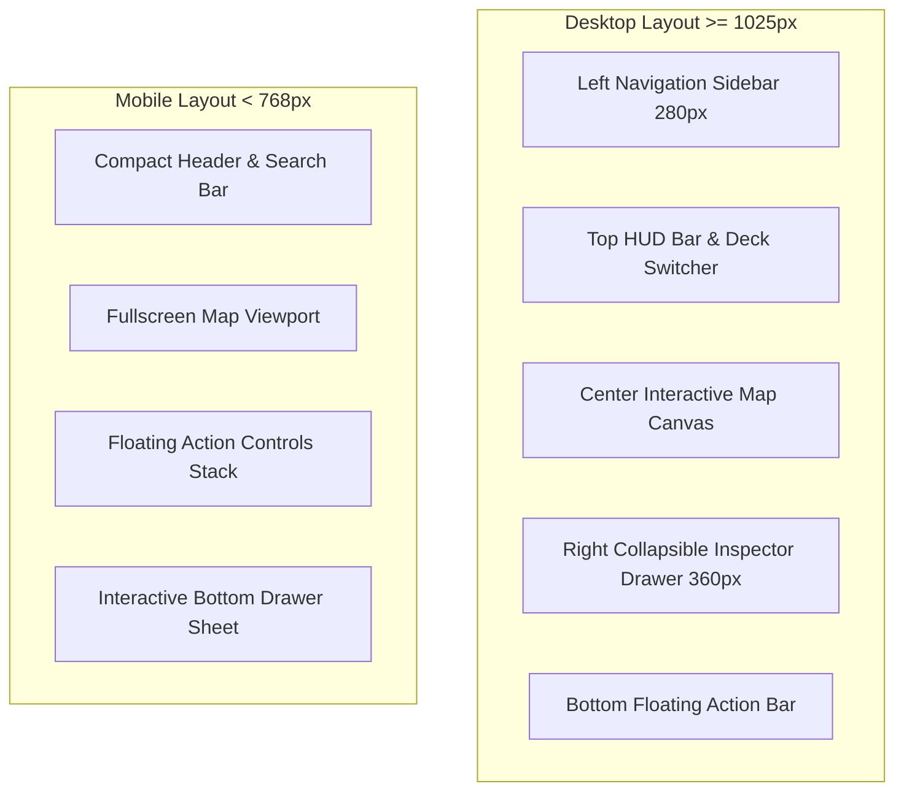
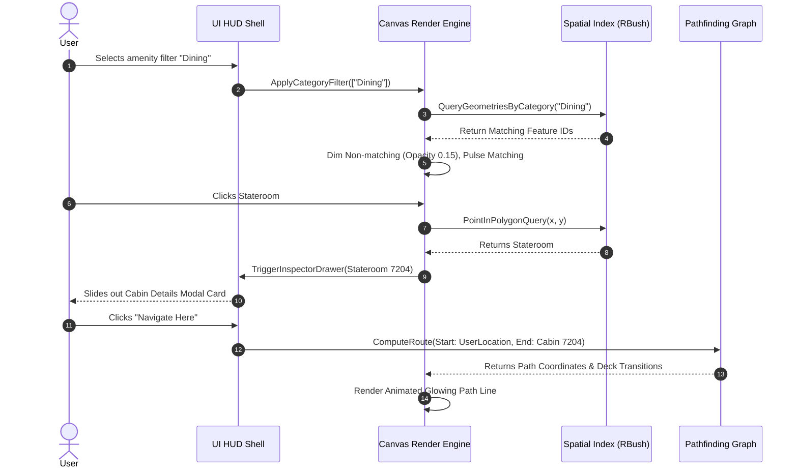

# Cruise Ship Deck Plan & Map Platform
## Interactive Deck Plan Viewer - Feature & UI Layout Specification

> **Document Version**: 1.0.0  
> **Status**: Final Engineering & Design Spec  
> **Target Audience**: Frontend Engineers, UX Designers, Spatial Map Developers  
> **Core Stack Integration**: WebGL 2D Canvas / SVG Layer Renderer, React/Vue UI Shell, Turf.js Spatial Math

---

## 1. Viewer Overview & Render Pipeline

The **Interactive Deck Plan Viewer** is the central spatial navigation interface for the Cruise Ship platform. It provides seamless zooming from a macro ship overview down to individual stateroom furniture layouts, supported by real-time route pathing, multi-deck elevator transitions, and amenity filtering.

```
┌─────────────────────────────────────────────────────────────────────────┐
│                       DECK PLAN RENDER PIPELINE                         │
├─────────────────────────────────────────────────────────────────────────┤
│ [ Geometry Data (GeoJSON) ] ──> [ Spatial Index (RBush) ]              │
│                                           │                             │
│ [ Dynamic LOD Engine ] <──────────────────┴─────> [ Tile Cache Buffer ] │
│         │                                                               │
│         ▼                                                               │
│ [ GPU Canvas / SVG Compositor ] ──> [ Interactive HUD Layer (HTML/CSS)] │
└─────────────────────────────────────────────────────────────────────────┘
```

### 1.1 Spatial Coordinate System

- **Primary Axis Alignment**:
  - **X-Axis**: Bow (Front = `0.0`) to Stern (Back = `1.0`).
  - **Y-Axis**: Port (Left = `0.0`) to Starboard (Right = `1.0`).
  - **Z-Axis**: Deck Elevation (Deck 01 Engine/Tank Deck up to Deck 18 Sky/Helipad Deck).
- **Origin Reference**: Top-left corner of the bounding box surrounding the hull boundary.
- **Canvas Projection**: 2D Orthographic projection with optional 2.5D Isometric tilt (`0°` to `45°` pitch).

---

## 2. Level of Detail (LOD) Threshold System

To maintain 60 FPS rendering performance while navigating thousands of spatial geometries (cabins, corridors, structural bulkheads), the viewer implements a **3-Tier Level-of-Detail (LOD)** engine based on canvas zoom scale factor ($Z_{scale}$).

```
  Zoom Level Scale ($Z_{scale}$)
  0.5x ─────────────── 1.5x ───────────────────── 4.0x ──────────────────── 10.0x+
   ├─── LOD 0: SHIP ───┤─────── LOD 1: ZONE ──────┤─────── LOD 2: CABIN ──────┤
   │ Macro Silhouette  │ Venue Boundaries         │ Stateroom Furniture       │
   │ Deck Elevations   │ Amenities & Elevators    │ Cabin Door Access & Egress│
```

### 2.1 LOD Threshold Matrix

| LOD Level | Zoom Scale Range ($Z_{scale}$) | Rendered Features & Layer Visibility | Text & Labeling Rules | Performance Budget |
| :--- | :--- | :--- | :--- | :--- |
| **LOD 0 (Ship Macro)** | `0.5x` to `1.49x` | • Outer Hull Boundary<br>• Superstructure Profile<br>• Macro Zones (Forward, Midship, Aft)<br>• Deck Number Callouts | • Deck Level Badges only (e.g. `DECK 06`) | < 500 Polygons<br>60 FPS |
| **LOD 1 (Deck Zone)** | `1.50x` to `3.99x` | • Venue Boundaries (Dining, Theater, Pool)<br>• Elevators & Stairwell Cores<br>• Main Corridor Trunks<br>• Category Color Fill Areas | • Major Venue Names<br>• Amenity Category Icons (Dining, Bar, Spa)<br>• Elevator Core Labels | < 2,500 Polygons<br>60 FPS |
| **LOD 2 (Detailed Cabin)** | `4.00x` to `10.0x+` | • Individual Stateroom Boundaries<br>• Cabin Doorway Access Points<br>• Bed & Furniture Outlines<br>• Emergency Egress Routes & Fire Doors<br>• Accessibility / Wheelchair Ramp Paths | • Cabin Numbers (e.g. `7204`) <br>• Sub-category Tags (`BALCONY`, `SUITE`)<br>• Detailed Venue Room Names | < 15,000 Polygons<br>60 FPS |

### 2.2 Dynamic Label Collision & Asset Swapping

```
               LABEL COLLISION RESOLUTION FLOW
┌───────────────────────────────────────────────────────────┐
│ Calculate Screen Coordinates of Geometries                │
└─────────────────────────────┬─────────────────────────────┘
                              │
                              ▼
┌───────────────────────────────────────────────────────────┐
│ Perform Bounding Box Overlap Check (Spatial R-Tree Index) │
└─────────────────────────────┬─────────────────────────────┘
                              │
               ┌──────────────┴──────────────┐
               ▼                             ▼
   [ Overlap Detected ]            [ No Overlap ]
               │                             │
               ▼                             ▼
┌───────────────────────────┐ ┌─────────────────────────────┐
│ Hide Secondary Label,     │ │ Render Primary Label & Icon │
│ Keep Primary Icon         │ │ with Fade-in Transition     │
└───────────────────────────┘ └─────────────────────────────┘
```

1. **Icon Scale Clamping**: Icons scale dynamically between `16px` and `32px`. They do not scale linearly with zoom beyond `Z = 4.0` to prevent visual clutter.
2. **Text Truncation**: Text labels automatically clip with an ellipsis (`...`) or fallback to category icons if screen space is $< 60\text{px}$ wide.
3. **Vector Asset Swapping**: SVG symbols switch from simplified single-color line shapes at LOD 1 to multi-colored detailed vector assets at LOD 2.

---

## 3. Visual States & Interactive Behaviors

### 3.1 Hover & Highlight States

When hovering over an interactive polygon (venue, cabin, or amenity):

```css
/* Interactive Polygon Hover Spec */
.deck-feature-polygon {
  fill-opacity: 0.40;
  stroke-width: 1px;
  stroke: var(--border-glass);
  transition: fill-opacity 150ms ease, stroke 150ms ease, filter 150ms ease;
}

.deck-feature-polygon:hover,
.deck-feature-polygon.state-hover {
  fill-opacity: 0.75;
  stroke: var(--accent-cyan);
  stroke-width: 2.5px;
  filter: drop-shadow(0 0 10px var(--accent-cyan-glow));
  cursor: pointer;
}
```

#### Mini Hover Tooltip Widget
- **Trigger**: Mouse hover ($> 200\text{ms}$ hover dwell) or touch tap preview.
- **Positioning**: Fixed `$8\text{px}$` offset to the top-right of the cursor; auto-flips if near viewport boundaries.
- **Content**:
  - Primary Label (e.g. `Lido Main Pool`).
  - Category Badge (`OUTDOOR DECK`).
  - Deck & Location (`Deck 6 • Midship`).

### 3.2 Active Route Pathing & Wayfinding UI

The navigation pathing engine computes the shortest accessible route between any two points on the vessel, including multi-deck transitions via elevators or stairs.

```
┌─────────────────────────────────────────────────────────────────────────┐
│ WAYFINDING PATH SPECIFICATION                                           │
├─────────────────────────────────────────────────────────────────────────┤
│                                                                         │
│  [ Start: Cabin #7204 ] ═══> ( Animated Neon Cyan Trail ) ═══> [ Elevator ]
│                                                                      ║  │
│                                                               ( Deck Change )
│                                                                      ║  │
│  [ Destination: Lido Pool ] <═══ ( Glowing Gold Trail ) <═══ [ Deck 6 ] │
└─────────────────────────────────────────────────────────────────────────┘
```

```css
/* Animated Route Path Line */
.route-path-line {
  fill: none;
  stroke: var(--accent-cyan);
  stroke-width: 5px;
  stroke-linecap: round;
  stroke-linejoin: round;
  stroke-dasharray: 12, 8;
  animation: marching-route-ants 1s linear infinite;
  filter: drop-shadow(0 0 8px var(--accent-cyan));
}

@keyframes marching-route-ants {
  from { stroke-dashoffset: 20; }
  to   { stroke-dashoffset: 0; }
}

.route-step-indicator {
  width: 16px;
  height: 16px;
  border-radius: 50%;
  background: var(--accent-gold);
  box-shadow: 0 0 16px var(--accent-gold);
}
```

#### Accessible Routing Toggle
- **Standard Route**: Uses nearest stairs or elevators for fastest traversal.
- **Accessible Route (ADA)**: Filters out all stairwell nodes in the pathfinding graph, routing exclusively through accessible elevator banks and ramp corridors with minimum $36\text{-inch}$ clearance.

### 3.3 Amenity & Category Filtering System

When a user selects one or more amenity categories (e.g. `Dining`, `Bars`, `Pools`):

1. **Non-Matching Features**: Opacity dims to `0.15` and filter transitions to `grayscale(80%)`. Pointer events on dimmed elements are disabled.
2. **Matching Features**: Retain `100%` opacity, enhanced with a pulsing outline halo (`@keyframes pulse-halo`).

```css
@keyframes pulse-halo {
  0%   { stroke-shadow: 0 0 0px var(--accent-cyan); }
  50%  { stroke-shadow: 0 0 14px var(--accent-cyan); }
  100% { stroke-shadow: 0 0 0px var(--accent-cyan); }
}
```

### 3.4 High-Resolution Upscaled Layer Toggle

For ultra-deep zooming into complex venue blueprints or technical deck overlays, users can activate the **High-Res Upscaled Layer**.

```
┌───────────────────────────────────────────────────────────────┐
│ HIGH-RES UPSCALE TOGGLE ARCHITECTURE                          │
├───────────────────────────────────────────────────────────────┤
│  Standard Vector Mesh ──> [ Enable Upscale Switch ]           │
│                                  │                            │
│                                  ▼                            │
│  [ Pre-render Off-screen WebGL Canvas @ 2x Device Pixel Ratio ]│
│                                  │                            │
│                                  ▼                            │
│  [ Swap Crisp Texture Quad into Main Render Loop ]            │
└───────────────────────────────────────────────────────────────┘
```

- **GPU Memory Management**: Upscaled texture tiles are loaded on-demand and purged from VRAM when panning $> 2$ viewport widths away.

---

## 4. Mobile vs Desktop Responsive UI Layout Specifications

The platform adapts seamlessly between workstation displays, mobile web viewports, and shipboard interactive kiosk terminals.

### 4.1 Layout Component Blueprint



### 4.2 Desktop Viewport Layout Specification ($\ge 1025\text{px}$)

```
+---------------------------------------------------------------------------------+
| TOP HUD BAR: Logo | [ DECK 04 ] [ DECK 05 ] [* DECK 06 *] [ DECK 07 ] | Search  |
+------------------+--------------------------------------------------+-----------+
| LEFT SIDEBAR     |                                                  | RIGHT     |
| (280px)          |                                                  | INSPECTOR |
|                  |                                                  | (360px)   |
| • Search & Filter|                                                  |           |
| • Amenity Chips  |            INTERACTIVE CANVAS AREA               | Venue /   |
| • Route Planner  |                                                  | Cabin     |
| • Deck Directory |                                                  | Details   |
|                  |                                                  | & Photos  |
|                  |                                                  |           |
+------------------+--------------------------------------------------+           |
| BOTTOM HUD BAR: Route Summary | [ + ] [ - ] [ Compass ] [ High-Res] |           |
+---------------------------------------------------------------------+-----------+
```

- **Grid Dimensions**:
  - `Left Sidebar`: Fixed `280px` width, collapsible to `64px` icon dock.
  - `Right Inspector Drawer`: Fixed `360px` width, overlay/slide-over with backdrop shadow.
  - `Canvas Area`: Flex `1` (Fills remaining width and height).

### 4.3 Mobile Viewport Layout Specification ($< 768\text{px}$)

```
+------------------------------------+
| [ 🔍 Search ] [ DECK 06 ▾ ] [ 🧭 ] |  <-- Compact Top Bar (56px)
+------------------------------------+
|                                    |
|                                    |
|         FULLSCREEN CANVAS          |
|                                    |
|                                    |
|                             [ + ]  |  <-- Floating Action
|                             [ - ]  |      Buttons (FAB)
|                             [ ⚡ ]  |
+------------------------------------+
| ═══ BOTTOM DRAWER HANDLE ═════════ |
| LIDO MAIN POOL & SUN DECK          |  <-- Bottom Sheet
| Deck 6 • Midship • Public Area     |      (Snap Points:
| [ NAVIGATE HERE ]  [ DETAILS ▾ ]   |       Peek / Half / Full)
+------------------------------------+
```

#### Bottom Drawer Sheet Snap Points

```mermaid
stateDiagram-v2
    [*] --> PeekState: Map Touch / Default
    State PeekState {
        description: 72px height - Title & Quick Navigate Button
    }
    
    PeekState --> HalfState: Drag Up / Tap Card
    State HalfState {
        description: 40% height - Mini gallery & Key Amenities
    }
    
    HalfState --> FullState: Drag Up / Tap Details
    State FullState {
        description: 85% height - Complete Description & Egress Path
    }

    FullState --> HalfState: Drag Down
    HalfState --> PeekState: Drag Down
```

---

## 5. Architectural & Layout Diagrams

### 5.1 Interactive Event Flow Sequence



---

## 6. Summary Specification Checklist

```
 [✓] Orthographic 2D & 2.5D Projection Modes Supported
 [✓] 3-Tier LOD Engine (LOD 0 Macro -> LOD 1 Zone -> LOD 2 Cabin Micro)
 [✓] Animated Wayfinding Pathing with Accessible (ADA) Elevator Rerouting
 [✓] Dynamic Label Collision Detection via R-Tree Spatial Index
 [✓] Responsive Desktop Split-View & Mobile 3-Snap Bottom Drawer Sheet
 [✓] GPU Texture Tile Management for High-Res Upscaled Raster/Vector Overlays
```
