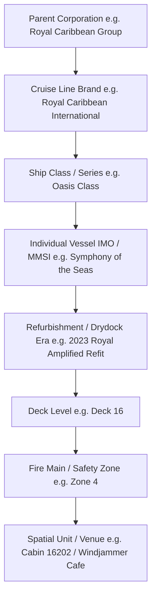
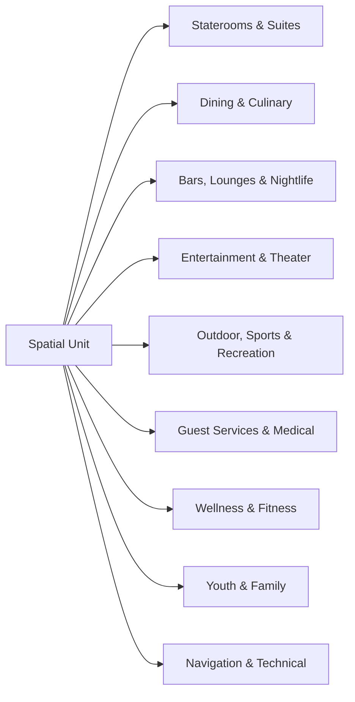
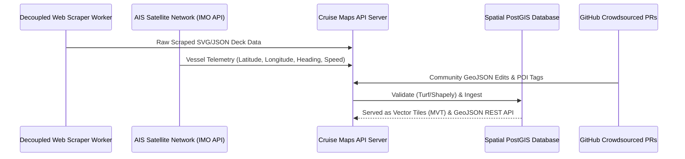

# Cruise Line Taxonomy, Ship Data Model, and Public Data Acquisition Strategies

> **Document Version:** 1.0.0  
> **Status:** Data Model Architecture & Taxonomy Specification  
> **Target System:** Open-Source Cruise Ship Maps API & Public Dataset Repository  

---

## Executive Summary

To model, store, and query cruise ship spatial data at scale, an open-source mapping system requires a standardized taxonomy and data model. Unlike static buildings on land, cruise ships represent complex hierarchical entities: a single vessel belongs to a ship class, operates under a brand owned by a parent corporation, features 10 to 22 deck levels, and contains thousands of spatial units ranging from staterooms to engine control rooms.

This document defines:
1. The global cruise industry **Corporate & Vessel Fleet Hierarchy** across all major cruise conglomerates.
2. Standardized **Deck Naming, Numbering, and Level Normalization Algorithms**.
3. A taxonomy and schema for **Spatial Units and Venues** (staterooms, dining, lounges, entertainment, outdoor recreation, technical/crew spaces).
4. Data acquisition strategies spanning **Public Web Scraping, AIS Telemetry Integration, and Crowdsourced Community Contributions**.
5. Formal **TypeScript / JSON Schema Definitions** for the API platform.

---

## 1. Cruise Industry Taxonomy & Fleet Hierarchy

### 1.1 Structural Hierarchy Model

Spatial and metadata queries follow a strict 8-tier hierarchical tree:



---

### 1.2 Comprehensive Corporate & Class Trees

#### 1. Royal Caribbean Group (RCG)

```
Royal Caribbean Group
├── Royal Caribbean International (RCI)
│   ├── Icon Class: Icon of the Seas (2023), Star of the Seas (2025), Legend of the Seas (2026)
│   ├── Oasis Class: Oasis (2009), Allure (2010), Harmony (2016), Symphony (2018), Wonder (2022), Utopia of the Seas (2024)
│   ├── Quantum / Quantum Ultra Class: Quantum (2014), Anthem (2015), Ovation (2016), Spectrum (2019), Odyssey of the Seas (2021)
│   ├── Freedom Class: Freedom (2006), Liberty (2007), Independence of the Seas (2008)
│   ├── Voyager Class: Voyager (1999), Explorer (2000), Adventure (2001), Navigator (2002), Mariner of the Seas (2003)
│   ├── Radiance Class: Radiance (2001), Brilliance (2002), Serenade (2003), Jewel of the Seas (2004)
│   └── Vision Class: Grandeur (1996), Rhapsody (1997), Enchantment (1997), Vision of the Seas (1998)
├── Celebrity Cruises
│   ├── Edge Class: Celebrity Edge (2018), Apex (2020), Beyond (2022), Ascent (2023), Xcel (2025)
│   ├── Solstice Class: Solstice (2008), Equinox (2009), Eclipse (2010), Silhouette (2011), Reflection (2012)
│   └── Millennium Class: Millennium (2000), Infinity (2001), Summit (2001), Constellation (2002)
└── Silversea Cruises (Ultra-Luxury / Expedition)
    ├── Silver Nova Class: Silver Nova (2023), Silver Ray (2024)
    └── Muse Class: Silver Muse (2017), Silver Moon (2020), Silver Dawn (2021)
```

#### 2. Carnival Corporation & plc

```
Carnival Corporation & plc
├── Carnival Cruise Line (CCL)
│   ├── Excel Class (LNG): Mardi Gras (2021), Carnival Celebration (2022), Carnival Jubilee (2023)
│   ├── Vista Class: Carnival Vista (2016), Carnival Horizon (2018), Carnival Panorama (2019), Carnival Firenze (2024), Carnival Venezia (2023)
│   ├── Dream Class: Carnival Dream (2009), Carnival Magic (2011), Carnival Breeze (2012)
│   ├── Conquest Class: Conquest (2002), Glory (2003), Valor (2004), Liberty (2005), Freedom (2007)
│   ├── Spirit Class: Spirit (2001), Pride (2001), Legend (2002), Miracle (2004), Luminosa (2022)
│   └── Fantasy Class: Carnival Elation (1998), Carnival Paradise (1998)
├── Princess Cruises
│   ├── Sphere Class (LNG): Sun Princess (2024), Star Princess (2025)
│   ├── Royal Class: Royal (2013), Regal (2014), Majestic (2017), Sky (2019), Enchanted (2021), Discovery Princess (2022)
│   └── Grand Class: Grand (1998), Golden (2001), Star (2002), Diamond (2004), Sapphire (2004), Caribbean (2004), Crown (2006), Emerald (2007), Ruby Princess (2008)
├── Holland America Line (HAL)
│   ├── Pinnacle Class: Koningsdam (2016), Nieuw Statendam (2018), Rotterdam (2021)
│   ├── Signature Class: Eurodam (2008), Nieuw Amsterdam (2010)
│   └── Vista Class: Zuiderdam (2002), Oosterdam (2003), Westerdam (2004), Noordam (2006)
├── Costa Cruises
│   ├── Excellence / Tuscan Class: Costa Smeralda (2019), Costa Toscana (2021)
│   └── Fortuna / Serena Class: Costa Fortuna, Costa Serena, Costa Pacifica, Costa Favolosa, Costa Deliziosa
├── Cunard Line
│   └── Queen Mary 2 (Ocean Liner), Queen Victoria (2007), Queen Elizabeth (2010), Queen Anne (2024)
└── Seabourn Cruise Line (Ultra-Luxury / Expedition)
    ├── Encore Class: Seabourn Encore (2016), Seabourn Ovation (2018)
    └── Venture Class (Expedition): Seabourn Venture (2022), Seabourn Pursuit (2023)
```

#### 3. Norwegian Cruise Line Holdings (NCLH)

```
Norwegian Cruise Line Holdings
├── Norwegian Cruise Line (NCL)
│   ├── Prima / Prima Plus Class: Norwegian Prima (2022), Norwegian Viva (2023), Norwegian Aqua (2025), Norwegian Luna (2026)
│   ├── Breakaway Plus Class: Norwegian Escape (2015), Joy (2017), Bliss (2018), Encore (2019)
│   ├── Breakaway Class: Norwegian Breakaway (2013), Norwegian Getaway (2014)
│   ├── Jewel Class: Norwegian Jewel (2005), Jade (2006), Pearl (2006), Gem (2007)
│   ├── Dawn Class: Norwegian Dawn (2002), Norwegian Star (2001)
│   └── Pride of America (Hawaii Flagged Standalone)
├── Oceania Cruises
│   ├── Allura Class: Vista (2023), Allura (2025)
│   └── Oceania Class: Marina (2011), Riviera (2012)
└── Regent Seven Seas Cruises
    └── Explorer Class: Seven Seas Explorer (2016), Splendor (2020), Grandeur (2023)
```

#### 4. MSC Cruises

```
MSC Cruises
├── MSC World Class: MSC World Europa (2022), MSC World America (2025), MSC World Asia (2026)
├── MSC Meraviglia / Meraviglia Plus Class: Meraviglia (2017), Bellissima (2019), Grandiosa (2019), Virtuosa (2021), Euribia (2023)
├── MSC Seaside / Seaside EVO Class: Seaside (2017), Seaview (2018), Seashore (2021), Seascape (2022)
├── MSC Fantasia Class: Fantasia (2008), Splendida (2009), Magnifica (2010), Divina (2012), Preziosa (2013)
└── Explora Journeys (Luxury Brand)
    └── Explora I (2023), Explora II (2024), Explora III (2026)
```

#### 5. Disney Cruise Line (DCL)

```
Disney Cruise Line
├── Wish / Triton Class: Disney Wish (2022), Disney Treasure (2024), Disney Destiny (2025), Disney Adventure (2025)
├── Dream Class: Disney Dream (2011), Disney Fantasy (2012)
└── Magic Class: Disney Magic (1998), Disney Wonder (1999)
```

#### 6. Viking Cruises

```
Viking Cruises
├── Viking Star Ocean Class: Star (2015), Sea (2016), Sky (2017), Sun (2017), Orion (2018), Jupiter (2019), Venus (2021), Mars (2022), Neptune (2022), Saturn (2023), Vela (2024), Vesta (2025)
└── Viking Expedition Class: Viking Octantis (2022), Viking Polaris (2022)
```

#### 7. Virgin Voyages

```
Virgin Voyages
└── Lady Ships Class: Scarlet Lady (2020), Valiant Lady (2021), Resilient Lady (2023), Brilliant Lady (2025)
```

---

## 2. Standardized Deck Naming & Numbering Conventions

Different cruise lines use disparate naming schemes for deck levels. The API normalizes all deck levels into a consistent structure:

- `deck_number`: Integer representing physical stack order ($1, 2, 3, \dots, 22$).
- `deck_code`: Short code string (`D01`, `D14`, `D14H`).
- `deck_name`: Official marketing name ("Lido Deck", "Compass Deck", "Promenade Deck").
- `vertical_ordinal`: Floating-point vertical elevation index relative to sea baseline for spatial rendering stack ordering.
- `is_passenger_accessible`: Boolean flag distinguishing guest decks from crew/engine decks.

### Deck Naming Conversion Matrix Table

| Physical Stack Level | Royal Caribbean | Carnival | NCL | Celebrity | Disney | Normalization Standard |
| :--- | :--- | :--- | :--- | :--- | :--- | :--- |
| **Deck 21–22** | Icon / Suite Sun Deck | - | Horizon / Haven | - | - | `Deck 21` / `Deck 22` |
| **Deck 18–20** | Suite Deck / Solarium | Sky Deck | The Haven Complex | The Retreat | Sun Deck | `Deck 18` / `Deck 19` |
| **Deck 15–17** | Windjammer / Pool | Sports Deck | Garden Cafe / Spa | Oceanview Cafe | Sports Deck | `Deck 15` / `Deck 16` |
| **Deck 14** | Lido / Adventure Ocean | Lido Deck | Pool Deck / Buffet | Resort Deck | Pool Deck | `Deck 14 (Lido)` |
| **Deck 5–8** | Royal Promenade | Promenade Deck | Waterfront / Galaxy | Plaza / Main | Atrium / Shops | `Deck 5` to `Deck 8` |
| **Deck 3–4** | Main Dining / Theater | Lobby / Main Deck | Stardust / Casino | Entertainment Deck | Walt Disney Theatre | `Deck 3` / `Deck 4` |
| **Deck 1–2** | Gangway / Medical | Riviera Deck | Medical Center | Medical / Tender | Gangway | `Deck 1` / `Deck 2` |
| **Deck 0 / Below** | Crew Mess / Engine | Crew Deck | Engine Control | Crew Deck | Engine Room | `Deck 0 (Crew/Engine)` |

---

## 3. Comprehensive Venue & Spatial Unit Categorization Schema

To support standardized spatial queries, every unit on a ship is assigned a primary `category` and `subcategory`.



### 3.1 Detailed Subcategory Definitions & Attributes

#### 1. Staterooms & Suites (`stateroom`)
- **Subcategories**: `inside`, `oceanview`, `balcony`, `virtual_balcony`, `cove_balcony`, `infinite_veranda`, `suite_junior`, `suite_grand`, `suite_owners`, `suite_loft`, `suite_royal`, `ship_within_a_ship` (e.g. RCI Star Class, NCL Haven, MSC Yacht Club, Celebrity Retreat).
- **Core Attributes**:
  - `stateroom_number` (string): e.g. `"14204"`.
  - `occupancy_min` / `occupancy_max` (int): Min/Max capacity ($1 \dots 8$).
  - `area_sqm` / `balcony_sqm` (float): Stateroom interior and exterior area.
  - `is_accessible_ada` (bool): Wheelchair accessible status.
  - `is_connecting` (bool): Presence of adjoining room door.
  - `connecting_stateroom_number` (string): Adjoining cabin ID.
  - `is_obstruction` (bool) / `obstruction_percent` (int): Lifeboat obstruction level ($0–100\%$).
  - `bed_configuration` (string): `king`, `twin_convertible`, `pullman`, `sofa_bed`.

#### 2. Dining & Culinary (`dining`)
- **Subcategories**: `main_dining_room`, `specialty_restaurant`, `buffet`, `casual_grab_go`, `room_service_galley`, `specialty_cafe`, `chef_table`.
- **Attributes**:
  - `cost_model`: `included`, `specialty_cover_charge`, `a_la_carte`.
  - `cuisine_type`: `steakhouse`, `italian`, `seafood`, `sushi`, `teppanyaki`, `french`, `mexican`, `international`.
  - `dress_code`: `casual`, `smart_casual`, `formal`.
  - `seating_capacity`: Total dining seats.
  - `requires_reservation`: Boolean flag.

#### 3. Bars, Lounges & Nightlife (`bar_lounge`)
- **Subcategories**: `pool_bar`, `pub`, `atrium_bar`, `speakeasy`, `piano_bar`, `cigar_lounge`, `nightclub`, `observation_lounge`, `wine_bar`, `bionic_robotic_bar`.
- **Attributes**: `has_live_music`, `outdoor_seating`, `age_restriction` (e.g., `21+`).

#### 4. Entertainment & Theater (`entertainment`)
- **Subcategories**: `main_theater`, `ice_rink`, `aquatheater`, `comedy_club`, `casino`, `cinema_4d`, `arcade`, `vr_lounge`.
- **Attributes**: `stage_type`, `seat_capacity`, `has_3d_projector`.

#### 5. Outdoor, Sports & Recreation (`recreation`)
- **Subcategories**: `pool_main`, `pool_adults_solarium`, `waterpark_kids`, `waterslide`, `zipline`, `flowrider_surf`, `ropes_course`, `sports_court`, `jogging_track`, `promenade_deck`, `helipad`.
- **Attributes**: `track_length_meters`, `laps_per_mile`, `pool_depth_meters`.

#### 6. Guest Services & Medical (`guest_services`)
- **Subcategories**: `guest_services_desk`, `shore_excursions`, `future_cruise_desk`, `medical_center`, `photo_gallery`, `conference_room`, `atm`, `wifi_helpdesk`.

#### 7. Wellness & Fitness (`wellness`)
- **Subcategories**: `thermal_suite`, `spa_treatment_room`, `salon`, `gymnasium`, `spin_studio`, `sauna_steamroom`.

#### 8. Youth & Family (`youth`)
- **Subcategories**: `nursery_infant`, `kids_club_3_5`, `kids_club_6_11`, `teen_club_12_17`, `game_arcade`.

#### 9. Navigation, Technical & Crew (`technical_crew`)
- **Subcategories**: `bridge`, `engine_control_room`, `galley_main`, `crew_mess`, `crew_bar`, `laundry_industrial`, `tender_embarkation`, `muster_station`.
- **Attributes**: `muster_zone_letter` (e.g., `"Muster Zone A"`).

---

## 4. Public Data Acquisition, Web Scraping, and Open Contribution Strategy

Building a comprehensive open dataset requires combining automated web extraction with open contribution standards.



---

### 4.1 Automated Web Scraping & Public API Integration

#### Scraper Targets & Technical Approaches
1. **Cruise Line Interactive Deck Plan APIs**:
   - Modern cruise sites utilize GraphQL or REST microservices to power web deck plan widgets.
   - Example endpoints:
     - `GET https://www.royalcaribbean.com/api/deck-plans/v2/ships/{shipCode}/decks/{deckNumber}`
     - `GET https://www.ncl.com/api/v1/deck-plan/{shipCode}/{deckId}`
   - Extraction workers pull raw vector coordinates, cabin category mapping tables, and venue bounding boxes.

2. **Public Marine/AIS Databases**:
   - Vessel specifications (IMO number, MMSI, Length Overall [LOA], Beam, Gross Tonnage [GT], Draft, Passenger Capacity, Crew Capacity) are scraped or queried via open AIS sources (MarineTraffic, VesselFinder, IMO Global Integrated Shipping Information System - GISIS).

#### Ethical & Legal Scraping Safeguards
- **Rate Limiting**: Worker threads execute with exponential backoff and a minimum delay of 1.5 seconds per request.
- **Robots.txt & Terms Compliance**: Respect `Robots.txt` crawl delays and store only public non-PII spatial geometry data.
- **Decoupled Architecture**: All scrapers reside in `scrapers/` micro-services, generating immutable JSON snapshot files (`data/snapshots/{ship_imo}_{timestamp}.json`) before database insertion.

---

### 4.2 Crowdsourced Community Contribution Workflow

Similar to OpenStreetMap (OSM), our platform enables community contributions:

1. **GeoJSON Schema Validation**:
   - Contributions submitted via GitHub Pull Requests undergo automated CI validation (`npm run validate:schema`).
   - Spatial sanity checks run via **Turf.js** or **Shapely** to prevent overlapping cabin polygons or out-of-bounds geometries.

2. **Web-Based Deck Plan Editor**:
   - A lightweight web editor (built on MapLibre GL JS + Leaflet Draw) allows users to trace cabin boundaries, tag amenities (e.g. AEDs, soda fountains), and submit JSON diffs.

---

## 5. Open API Specification & Data Model (JSON Schemas)

The following TypeScript definitions specify the canonical API payload models:

```typescript
/**
 * Canonical Data Model Definitions for Open Cruise Maps API
 */

export interface ParentCorporation {
  id: string; // e.g. "rcg"
  name: string; // e.g. "Royal Caribbean Group"
  stock_ticker?: string; // e.g. "RCL"
}

export interface CruiseLineBrand {
  id: string; // e.g. "rccl"
  parent_corporation_id: string; // "rcg"
  name: string; // "Royal Caribbean International"
  code: string; // "RCI"
}

export interface ShipClass {
  id: string; // e.g. "oasis_class"
  brand_id: string; // "rccl"
  name: string; // "Oasis Class"
  gross_tonnage_avg: number; // e.g. 226838
  passenger_capacity_double_occ: number; // e.g. 5518
}

export interface Vessel {
  id: string; // e.g. "symphony_of_the_seas"
  imo_number: number; // e.g. 9744001
  mmsi_number: number; // e.g. 311000646
  name: string; // "Symphony of the Seas"
  ship_class_id: string; // "oasis_class"
  build_year: number; // 2018
  last_refurbishment_year?: number; // 2023
  length_overall_meters: number; // 362.1
  beam_meters: number; // 47.4
  height_meters: number; // 72.5
  total_decks: number; // 18
  passenger_decks: number; // 16
  stateroom_count: number; // 2759
}

export interface DeckLevel {
  id: string; // e.g. "symphony_d14"
  vessel_id: string; // "symphony_of_the_seas"
  deck_number: number; // 14
  deck_code: string; // "D14"
  deck_name: string; // "Lido Deck"
  vertical_ordinal: number; // 14.0
  is_passenger_accessible: boolean; // true
  is_crew_only: boolean; // false
  svg_raster_aspect_ratio: number; // 2.0
  bounding_box_hull_meters: [number, number, number, number]; // [xmin, ymin, xmax, ymax]
}

export type VenueCategory = 
  | 'stateroom' 
  | 'dining' 
  | 'bar_lounge' 
  | 'entertainment' 
  | 'recreation' 
  | 'guest_services' 
  | 'wellness' 
  | 'youth' 
  | 'technical_crew';

export interface SpatialUnit {
  id: string; // e.g. "unit_sym_14204"
  deck_id: string; // "symphony_d14"
  vessel_id: string; // "symphony_of_the_seas"
  unit_name: string; // "Balcony Stateroom 14204" or "Windjammer Cafe"
  category: VenueCategory;
  subcategory: string; // "balcony" or "buffet"
  stateroom_number?: string; // "14204"
  fire_main_zone?: string; // "Zone 3"
  muster_station_code?: string; // "Muster B"
  attributes: {
    occupancy_max?: number;
    is_accessible_ada?: boolean;
    is_connecting?: boolean;
    connecting_unit_id?: string;
    cost_model?: 'included' | 'cover_charge' | 'a_la_carte';
    cuisine_type?: string;
    seating_capacity?: number;
  };
  geometry: {
    type: "Polygon" | "MultiPolygon";
    coordinates: number[][][]; // Local hull meters or GeoJSON coordinates
  };
}

export interface AmenityPOI {
  id: string; // e.g. "poi_sym_d14_aed_1"
  deck_id: string;
  type: 'aed' | 'elevator_bank' | 'stairwell' | 'restroom_unisex' | 'restroom_accessible' | 'towel_station' | 'atm';
  name: string;
  icon_symbol: string;
  geometry: {
    type: "Point";
    coordinates: [number, number]; // [x, y]
  };
}
```

---

## 6. Conclusions & Architectural Roadmap

1. **Taxonomy Governance**: Enforce the 8-tier hierarchy (`Parent -> Brand -> Class -> Vessel -> Refit -> Deck -> Zone -> Unit`) across all API query filters and relational schemas.
2. **Normalized API Representations**: Use the standardized deck mapping matrix and TypeScript schema definitions to expose consistent endpoint payloads across all cruise lines.
3. **Data Acquisition Strategy**: Deploy automated scrapers in `scrapers/` to fetch SVG/GraphQL deck plan data, while maintaining open GeoJSON submission standards for crowdsourced validation.
