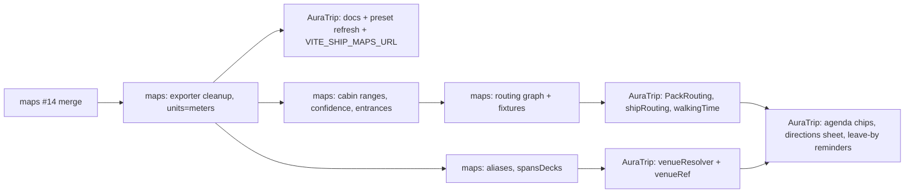

# Roadmap — AuraTrip Integration & Onboard Event Wayfinding

_Written 2026-09-15. Status: **In progress** — Phase 0 shipped 2026-09-16; Phase 1 and
P4.1 underway. Live tracking: [#24](https://github.com/doomstar288/cruise-ship-maps/issues/24).
Spans two repos:_

- **Producer** — `cruise-ship-maps` (this repo): deck data, Ship Map Pack exports.
- **Consumer** — `big-trip-planner` (AuraTrip): offline PWA that renders packs in its deck viewer.

Related: [PR #14](https://github.com/doomstar288/cruise-ship-maps/pull/14) (real-proportion Xcel map),
AuraTrip `docs/SHIP_MAP_SERVICE_INTERFACE.md`, `docs/EPIC_A_ONBOARD_DESIGN.md`,
`docs/EPIC_D_INTERACTIVE_DECK_PLAN_DESIGN.md`, `docs/EPIC_F_FITNESS_PEDOMETER_DESIGN.md`.

---

## 1. The user feature

> "When something is happening on the ship — a show, my dinner booking, trivia — show me
> where it is, give me directions, tell me how long the walk takes, and when to leave."

Concretely, for an item on the **Onboard Agenda**:

```
19:30  Le Voyage by Daniel Boulud        📍 Deck 4 · Midship
       🚶 6–8 min from Stateroom 10175 · leave by 19:20      [Directions]
```

Tapping **Directions** opens the deck viewer on the origin deck with the route drawn,
a deck-change step ("Midship elevators down to Deck 4"), and the path on the destination
deck. It must work **offline at sea**, because that is the only time anyone needs it.

---

## 2. Where things stand today

| Capability | Cruise Ship Maps | AuraTrip |
|---|---|---|
| Vector deck geometry | ✅ 15 real guest decks at 327 m × 39 m (PR #14) | ✅ Tier 0 `DeckVectorMap` renders packs |
| Pack transport + offline cache | ✅ static `/v1/ships/**.json` on `prebuild` | ✅ IDB + SW `CacheFirst`, inert unless `VITE_SHIP_MAPS_URL` set (on in production since Phase 0) |
| Onboard events | — | ✅ `OnboardReservation[]` (Epic A), daily-program parser, agenda, reminders |
| Venue on an event | — | ⚠️ free text only (`reservation.venue`, `ParsedActivity.notes`) |
| Traveler's cabin | — | ✅ `TripMetadata.cabinNumber`, `ShipCard.cabin` |
| Wayfinding | ⚠️ web-app only (`src/utils/wayfinding.js`: corridor → elevator → corridor) | ❌ elevators are pins only; no routes |
| Walking time | ⚠️ flat 70 m/min estimate in the web app | ❌ |
| Walking pace personalization | — | 📝 Epic F pedometer proposed |

**The gap is three missing links:** (1) routing data that travels *inside* the pack so
AuraTrip can route offline, (2) a resolver from an event's free-text venue to a pack
feature, and (3) a walking-time model plus the UI that puts it on the agenda.

---

## 3. Findings that shape the plan

Found while researching the real ship and reading both codebases. Each maps to a task below.

1. **Crew service strips leak into AuraTrip's venue list.** PR #14 adds centreline
   "Crew Service Area" tiles (`hideLabel: true`). The exporter emits them as
   `featureType: "venue"`, and AuraTrip's adapter lists every `venue` in search. → P0.2
2. **AuraTrip's docs and presets describe the old data.** `SHIP_MAP_SERVICE_INTERFACE.md`
   says coordinates are "plan units, not metres" and `deckCount: 17`. The Tier 1 preset
   `src/data/shipPresets/celebrityXcel.json` still has Eden on Deck 4 and Sunset Bar on
   Deck 12. Both are now wrong: packs are metres, 15 decks, The Bazaar replaced Eden, and
   the Sunset Bar is at the stern of Deck 15. → P0.4, P0.5
3. **Synthetic cabin numbers ≠ real cabin numbers.** The generator numbers cabins
   bow→stern and assumes even numbers are port. A guest's real cabin 10175 will resolve to
   *a* synthetic 10175, which may be tens of metres from the real one. Until this is fixed,
   any route "from your cabin" is only approximate. → P1.2
4. **Venue positions have mixed confidence.** Deck and fore/aft zone come from published
   descriptions and are reliable. Side of ship is unverified for the main dining rooms,
   Casino, The Club, Luminae, Blu, Rooftop Garden, Guest Relations and Camp at Sea. Sources
   also conflict on the Fitness Center (14 vs 15), Mast Grill (14 vs 16), Sunset Bar (15
   only vs 15–16) and the Martini Bar (2 vs 3). → P1.1, P1.3
5. **Event venue text is messy.** Real inputs look like `"Deck 5 — Le Bistro"`,
   `"The Theater"`, `"Pool Deck"`, `"OVC"`. The parser's venue keywords also include
   other ships' venues (Tuscan Grille, Murano, Sushi on Five). Some venues span decks: The
   Theatre is on 3–5, The Bazaar on 4–6, the Magic Carpet on 2/5/14/16. → P4
6. **Routing must be on-device.** The interface doc already rules out a live `POST /route`
   because it fails offline. Its own suggestion is to ship the graph inside the pack. → P2
7. **Walking time is not just distance.** On a 327 m ship, elevator waits at show start or
   dinner seating can outweigh the walk. Step-free guests cannot take stairs. → P3.2

---

## 4. Phased plan

Sizes: **S** ≤ 1 day, **M** 2–4 days, **L** 1–2 weeks. Each phase ends in something
shippable; later phases never block earlier value.

### Phase 0 — Land it and turn it on  `S–M` · both repos · ✅ shipped 2026-09-16

| # | Status |
|---|---|
| P0.1 | ✅ [#14](https://github.com/doomstar288/cruise-ship-maps/pull/14) |
| P0.2, P0.3 | ✅ [#26](https://github.com/doomstar288/cruise-ship-maps/pull/26). All 38 crew/back-of-house features (not only the `hideLabel` strips) now export as `corridor`. |
| P0.4, P0.7 | ✅ [AuraTrip #166](https://github.com/doomstar288/big-trip-planner/pull/166). Docker `build.args` default to the Pages URL. It also fixed the SW pack rule, which never matched cross-origin, and made pack URLs revision-addressed (`plan.json?rev=`) with a `NetworkFirst` catalog, so updates aren't pinned for 180 days. |
| P0.5 | ✅ [AuraTrip #165](https://github.com/doomstar288/big-trip-planner/pull/165) |
| P0.6 | ✅ [#17](https://github.com/doomstar288/cruise-ship-maps/issues/17). The repo was private with Pages disabled; it was made public and the self-hosted runner retired first. Base URL `https://doomstar288.github.io/cruise-ship-maps`, `access-control-allow-origin: *`. Fork-PR deploy guard [#25](https://github.com/doomstar288/cruise-ship-maps/pull/25). |

Original task list:

Goal: AuraTrip users see the corrected Xcel map from the published service.

| # | Repo | Task |
|---|---|---|
| P0.1 | maps | Merge PR #14. |
| P0.2 | maps | Exporter: skip `hideLabel` decorative features, or emit them as `corridor` so the adapter treats them as circulation. Add an exporter test that no `Crew & Service` feature is a `venue`. |
| P0.3 | maps | Set `geometry.units` to `"meters"`. Additive, so no `specVersion` bump. Keep `extent` as the only normalizer. |
| P0.4 | AuraTrip | Update `SHIP_MAP_SERVICE_INTERFACE.md`: metres, 15 decks, extent now includes the outboard Magic Carpet and the bridge wings. |
| P0.5 | AuraTrip | Re-author `shipPresets/celebrityXcel.json` from the pack's venue facts: The Bazaar replaces Eden, Sunset Bar on 15, Magic Carpet stops 2/5/14/16. Tier 1 and Tier 0 must agree. |
| P0.6 | maps | Confirm GitHub Pages deploys `/v1/ships/index.json` and that the response allows cross-origin fetch from AuraTrip's origin. |
| P0.7 | AuraTrip | Set `VITE_SHIP_MAPS_URL` (the Pages base URL) in the production build/deploy config. Smoke-test online, then offline after first load. |

**Accept when:** a trip with a "Celebrity Xcel" cruise event shows the 15-deck vector map
in Travel Tools → Ship & Deck Plan. Search finds "Sunset Bar" on Deck 15 and no "Crew
Service Area". The map loads in airplane mode after one online visit.

### Phase 1 — Data you can route on  `M` · maps

Goal: positions trustworthy enough that walking times are not misleading.

- **P1.1 Verify venue placement against a real plan (facts only).** Use the guest's
  own Celebrity-issued PDF or the line's site to confirm deck, fore/aft and **side** for
  every public venue. Record facts, never trace geometry; that keeps the MIT/synthetic
  licensing that AuraTrip's Epic D spike depends on. Resolve the conflicts in §3.4.
- **P1.2 Real cabin-number mapping.** Author per-deck cabin number ranges per section as
  facts, e.g. `{ deck: 8, side: "port", from: 8100, to: 8198, xFrom: 20, xTo: 150 }`.
  Number generated cabins from those ranges so real numbers land in the right section.
  Confirm the actual odd/even side convention. Until done, AuraTrip labels
  cabin-origin routes "approximate".
- **P1.3 Confidence per feature.** Add an additive `positionConfidence:
  "verified" | "zone" | "estimated"` so the consumer can soften the UI, e.g. "near
  midship, starboard side" instead of a precise pin.
- **P1.4 Venue entrances.** Big rooms have doors, not centres. Add an additive
  `entrances: [[x, y], …]` on large venues (Theatre, main dining rooms, Bazaar, Pool Club).
  Routing targets the nearest entrance; the pin stays at `center`.

**Accept when:** every listed venue has `positionConfidence ≥ zone`. Cabin numbers from
the real ship's published ranges resolve to the correct deck section. Producer tests
assert each entrance sits on a corridor edge of its venue.

### Phase 2 — Routing graph in the pack  `L` · maps

Goal: ship a small, offline-routable network with every pack.

Additive `routing` block. Unknown to v1 consumers, so no `specVersion` bump. Document it in
the interface spec.

```jsonc
"routing": {
  "walkingSpeedMps": 1.1,            // producer's default; consumers may override
  "nodes": [
    { "id": "d8-corr-p-120", "deck": 8, "at": [120, 8.5], "kind": "corridor" },
    { "id": "d8-elev-mid",   "deck": 8, "at": [192, 19.5], "kind": "elevator_lobby", "bank": "mid" },
    { "id": "d8-stair-mid",  "deck": 8, "at": [192, 12],  "kind": "stair" },
    { "id": "d4-v4-le-voyage-e1", "deck": 4, "at": [138, 8.5], "kind": "entrance", "featureId": "v4-le-voyage" }
  ],
  "edges": [
    { "from": "d8-corr-p-120", "to": "d8-elev-mid", "kind": "walk", "lengthM": 72.4 },
    { "from": "d8-elev-mid", "to": "d4-elev-mid", "kind": "elevator", "decks": 4 },
    { "from": "d8-stair-mid", "to": "d7-stair-mid", "kind": "stairs", "decks": 1, "stepFree": false }
  ]
}
```

- **P2.1 Generate from the same geometry.** Corridor centrelines, cross-passages at each
  core, stair and elevator nodes per deck, and entrance nodes (P1.4) or nearest-corridor
  projections for venues and cabins. Cabins do not need nodes: consumers snap a cabin to its
  nearest corridor node, which keeps the pack small.
- **P2.2 Graph invariants as tests:** every listed venue is reachable from every elevator
  bank; edge lengths match the geometry; there are no edges through hull or venue
  interiors; each deck's walk graph is one connected piece.
- **P2.3 Size budget:** ≤ 15 % pack growth gzipped. Roughly 60–100 nodes per deck should
  land well under that; measure it in the exporter summary line.
- **P2.4 One router, two consumers.** Replace the web app's heuristic `wayfinding.js`
  with a small dependency-free Dijkstra/A\* over `routing`, so the maps site and AuraTrip
  compute identical routes. AuraTrip keeps its own TypeScript port; the fixtures below are
  the contract.
- **P2.5 Shared route fixtures.** Publish `v1/ships/<id>/route-fixtures.json` with
  origin, destination, expected length ± tolerance and expected deck changes, so both
  repos' tests catch drift.

**Accept when:** the maps site draws multi-deck routes from the graph. The fixtures pass
in both repos. The pack stays within budget.

### Phase 3 — On-device routing & walking-time model  `M–L` · AuraTrip

Pure logic in `src/utils/*` with sibling tests, per AuraTrip conventions.

- **P3.1 Wire contract.** Add `PackRouting` to `types/shipMapPack.ts`. The sanitizer drops
  dangling edges and non-finite lengths, and treats a malformed `routing` as absent. It
  must never reject the whole pack, because the map still works without routes.
- **P3.2 `utils/walkingTime.ts`.** Returns a **range**, never false precision:

  | Component | Default (tunable) | Notes |
  |---|---|---|
  | Walk | distance ÷ 1.1 m/s | Crowded public decks ×1.25 |
  | Stairs | 15 s per deck | Excluded when `stepFree` |
  | Elevator wait | 45 s off-peak, 150 s peak | Peak = ±20 min around show starts, dinner seatings, disembark |
  | Elevator ride | 10 s + 4 s per deck | |
  | Buffer | +2 min for reservations | Configurable |

  Output example: `{ minMinutes: 6, maxMinutes: 8, mode: "elevator", steps: [...] }`.
  Prefer stairs for a change of 1–2 decks unless step-free.
- **P3.3 `utils/shipRouting.ts`.** Snap origin and destination to graph nodes, run
  Dijkstra with a cost of *time*, not metres, then split the route into per-deck
  polylines plus deck-change steps. Coordinates go through the same `extent` projection as
  `shipMapAdapter.ts`.
- **P3.4 Render routes in `DeckVectorMap`.** Add a polyline layer per deck, start/end
  and elevator markers, and a "Next: Deck 4" control that flips decks along the route.
  Keep the attribution line and add "Approximate route".

**Accept when:** a unit test routes Stateroom 10175 → Le Voyage (Deck 4) in 6–8 min via
elevators, and step-free mode never uses stairs. The viewer shows the route across both
decks with the network disabled.

### Phase 4 — Event → venue linking (the core of the request)  `M` · both repos

- **P4.1 Aliases in the pack (maps).** Additive `aliases: string[]` per feature:
  "The Theater", "Theatre"; "OVC", "Buffet" for Oceanview Café; "Pool Deck", "Resort Deck"
  for Celebrity Pool Club; "Le Petit Chef" for Le Grand Bistro. Also add `spansDecks: [3, 4, 5]`
  for multi-deck venues.
- **P4.2 `utils/venueResolver.ts` (AuraTrip).**
  - Input: `reservation.venue`, `reservation.title`, `ParsedActivity.notes`, `TripEvent.location`.
  - Normalize: case, punctuation, "the", accents (Café/Cafe), and extract a deck hint from
    `"Deck 5 —"` or `reservation.deck`.
  - Score exact name/alias, then token overlap, with a bonus when the deck matches. Return
    `{ featureId, deck, confidence }` or `null` below threshold.
  - For multi-deck venues, choose the deck whose entrance is nearest the origin (Theatre:
    Deck 4 from above, Deck 3 from below).
  - Never guess silently. An unresolved venue shows "Pick on map".
- **P4.3 Remember the link.** Add optional `venueRef?: { shipId: string; featureId: string }`
  to `OnboardReservation`. It is optional, so no migration is needed, and it round-trips
  export/import like the rest of Epic A. A user's manual pick sets it; re-imports reuse it
  by title.
- **P4.4 Clean parser keywords.** Split `cruiseActivitiesParser` venue keywords into a
  generic list plus per-ship sets driven by the pack's names and aliases, so Solstice-class
  venues stop matching on Xcel.

**Accept when:** ≥ 90 % of a real Xcel daily program's located activities auto-resolve,
the rest prompt, and no activity resolves to the wrong venue. Measure against a
checked-in, anonymized text fixture.

### Phase 5 — Agenda UX: directions, times, leave-by  `M` · AuraTrip

- **P5.1 Agenda chips.** In `OnboardAgenda`, show "📍 venue · Deck N" plus
  "🚶 6–8 min · leave by 19:20" when a route is computable.
- **P5.2 Origin picker.** Options: My cabin (`ShipCard.cabin` / `TripMetadata.cabinNumber`),
  Previous agenda item (chain the day), Where I am now (pick a venue), Pick on map.
  Remember the last choice per day.
- **P5.3 Directions sheet.** Deck viewer opens on the route with step list, time range and
  a step-free toggle. The viewer is portaled, per AuraTrip's `.cq-host` rule.
- **P5.4 Leave-by reminders.** Extend `buildReservationReminder` so the lead time =
  walking max + buffer instead of a flat 30 min. It stays idempotent via `reminderId`.
- **P5.5 Back-to-back warnings.** On the Timeline onboard card, flag items where the next
  item's leave-by time is before this one ends ("Trivia ends 19:15; leave by 19:20 for
  dinner — tight").
- **P5.6 Accessibility & honesty.** Every field needs an accessible name (formLabels test).
  Text alternatives accompany the drawn route. Always show "Approximate — synthetic
  layout" when `positionConfidence` is below `verified`.

**Accept when:** browser-verified at 1280 and 375 px. An imported daily program shows walk
times on resolved items. A reminder fires at the adjusted leave-by time. Everything works
offline after first load.

### Phase 6 — Later

- **Personal pace:** use Epic F pedometer cadence/stride to replace the 1.1 m/s default,
  and let users pick "leisurely / normal / brisk" until then.
- **Crowd-aware elevators:** weight peak windows from the day's own agenda (a 19:00
  Theatre show makes 18:40–19:00 peak around the forward banks).
- **More ships:** the generator is parameterized by envelope, so Edge-series sisters
  (Edge, Apex, Beyond, Ascent) are mostly deck tables. The catalog, name matching and
  routing need no consumer change (interface doc §7).
- **Community corrections:** "This venue is actually on the port side" becomes a facts
  PR against the maps repo, following the `cruise_bar_menus.json` community-catalog
  precedent.
- **REST mode:** only if a live service adds value beyond static packs; routing stays
  on-device regardless.

---

## 5. Suggested PR sequence



Phases 0 → 1 → 2 are strictly ordered on the producer side. Phase 4's resolver can start
in parallel with Phase 2, because it only needs names and aliases, not routes.

---

## 6. Risks & open questions

| Risk | Impact | Mitigation |
|---|---|---|
| Synthetic layout differs from the real ship | Wrong directions erode trust | Confidence field, ranges not minutes, "approximate" copy, P1 verification, community corrections |
| Copyright creep while verifying | Breaks the licensing basis of Tier 0 | Record facts only (deck, zone, side, number ranges). Never trace or embed plan imagery. Review in PR template |
| Real cabin numbering unknown | Cabin-origin routes misplaced | P1.2 ranges. Until then, offer "Pick on map" for the cabin |
| Pack growth from routing | Slower first load at port Wi-Fi | P2.3 budget, cabins snap to corridors (no cabin nodes) |
| Venue renames between sailings | Resolver misses | Aliases, remembered `venueRef`, prompt instead of guess |
| Elevator-time defaults are guesses | Leave-by too early or late | Show ranges, tune from user feedback, Epic F data later |
| GitHub Pages CORS/availability | Map never loads | P0.6 check. Packs are cached forever once fetched |

**Open questions for the team**

1. Should `venueRef` live on `OnboardReservation` only, or also on `ParsedActivity` in port
   plans?
2. Is "Previous agenda item" the right default origin, or "My cabin"?
3. Do we want the maps site itself to accept a daily program (paste → routes), or keep that
   experience AuraTrip-only?

---

## 7. Research sources

Public venue and deck facts used for PR #14 and this plan (facts only, no plan imagery):

- [CruiseMapper — Celebrity Xcel deck plans](https://www.cruisemapper.com/deckplans/Celebrity-Xcel-2195)
- [Attractions Magazine — Celebrity Xcel deck plan](https://attractionsmagazine.com/celebrity-xcel-cruise-ship-deck-plan/)
- [Celebrity Cruises — Celebrity Xcel deck plans](https://www.celebritycruises.com/cruise-ships/celebrity-xcel/deck-plans)
- [Cruise Critic — Celebrity Xcel deck plans](https://www.cruisecritic.com/cruise/celebrity/celebrity-xcel/deck-plans)
- [Gangwaze — Celebrity Xcel deck plans](https://gangwaze.com/cruise-lines/celebrity-cruises/celebrity-xcel/deck-plans) (rate-limited during research; re-check in P1.1)
