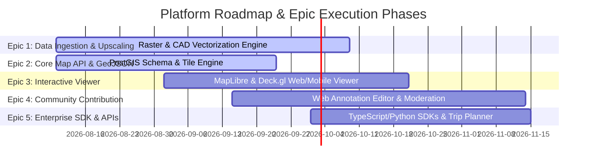

# Open-Source Cruise Ship Deck Plan & Map Platform
## Agile Framework, Governance & Product Backlog Specification

> **Document Version:** 1.0.0  
> **Status:** Approved Architecture Baseline  
> **Maintainer:** System Architecture & Scrum Core Team  

---

## 1. Open-Source Agile Framework & Governance

The Open-Source Cruise Ship Deck Plan & Map Platform operates as a hybrid Agile framework combining **Scrum** sprint execution with an **Open-Source Software (OSS) Governance Model**. This framework bridges core engineering velocity with global community contribution, maintainer code reviews, and public developer API transparency.

```mermaid
flowchart TD
    subgraph Governance ["Community & Maintainer Governance"]
        RFC["Public RFC Process\n(GitHub Discussions)"]
        ISSUE["Community Issue Tracker\n(Bugs, Feature Requests)"]
        BOARD["Public GitHub Project Board\n(Automated Kanban)"]
    end

    subgraph DualTrack ["Dual-Track Agile Process"]
        subgraph Track1 ["Track 1: Discovery & Standardisation"]
            DISC["GeoJSON Deck Standard Specs"]
            CAD["Data Extraction R&D"]
            API_SPEC["OpenAPI 3.1 Specs"]
        end
        subgraph Track2 ["Track 2: 2-Week Sprint Delivery"]
            PLAN["Sprint Planning"]
            DEV["Feature Engineering & Testing"]
            REVIEW["Public Review & Tile Benchmark"]
            RETR["Retrospective & Release"]
        end
    end

    subgraph CI_CD ["Automated Quality Gates"]
        LINT["PostGIS Schema & OpenAPI Linter"]
        TEST["Geospatial & Integration Tests"]
        BENCH["Vector Tile Latency Benchmark"]
    end

    RFC --> DISC
    ISSUE --> PLAN
    BOARD <--> Track2
    Track1 --> Track2
    DEV --> LINT --> TEST --> BENCH --> REVIEW
```



### 1.1 Dual-Track Agile & Community Cadence
* **Sprint Cadence:** Fixed 2-week iterations starting every second Monday at 09:00 UTC.
* **Dual-Track Workflow:**
  * **Track 1 (Discovery & Schema Standards):** Conducted continuously by Core Architects and Community Working Groups. Focuses on GeoJSON extension proposals, OpenAPI endpoint design, CAD parsing heuristics, and spatial dataset licensing verification.
  * **Track 2 (Delivery Sprints):** Executed by core developers and community maintainers. Focuses on production code, PostGIS migrations, tile server pipelines, viewer UI components, and SDK releases.

### 1.2 Scrum Ceremonies

| Ceremony | Schedule / Duration | Attendees | Objective & Open-Source Artifact |
| :--- | :--- | :--- | :--- |
| **Sprint Planning** | Mon 09:00 UTC (90 mins) | Core Team, Maintainers, Community Leads | Commit to Sprint Backlog from prioritized GitHub Epics. Assign Story Points. |
| **Daily Async Standup** | Daily (Slack / GitHub Thread) | All Contributors | Post 3 bullets: Yesterday's progress, Today's focus, Blockers. Bot aggregates status. |
| **Backlog Refinement** | Wed Wk 1 (60 mins) | Product Owner, Architects | Estimate stories (Fibonacci), detail Acceptance Criteria (BDD), mark `good-first-issue` items. |
| **Sprint Review & Demo** | Fri Wk 2 15:00 UTC (60 mins) | Open to Public Community | Live demo of map rendering, tile benchmarks, API endpoints, and newly ingested ship decks. |
| **Sprint Retrospective** | Fri Wk 2 16:15 UTC (45 mins) | Core Maintainers | Inspect team velocity, CI pipeline bottlenecks, community review turnaround times. |

### 1.3 Open-Source Contribution Workflow
1. **Request for Comments (RFC):** Major architectural changes (e.g., GeoJSON spec changes, spatial indexing shifts) require an RFC submission in `docs/rfcs/` with a 7-day public comment period.
2. **Issue Triage:** Incoming GitHub issues are classified within 24 hours into `bug`, `enhancement`, `data-request`, or `good-first-issue`.
3. **Pull Request (PR) Lifecycle:**
   * Branch naming convention: `feature/US-<id>-short-description`, `fix/US-<id>-short-description`.
   * PRs require **2 core maintainer approvals** + passing CI/CD suite (linting, PostGIS spatial unit tests, vector tile rendering regression).
   * Automated CLA (Contributor License Agreement) check enforced via GitHub Action.

### 1.4 Key Performance Metrics & Service Level Agreements (SLAs)

```
+-------------------------------------------------------------------------------+
| CORE PLATFORM SLAs & METRICS                                                 |
+-------------------------------------------------------------------------------+
| Metric                                   | Target Threshold                   |
+------------------------------------------+------------------------------------+
| API Uptime (Edge & Tile Server)          | 99.95% Availability                |
| P99 Vector Tile Response Time (MVT)      | < 45 ms (Edge Cache Hit < 10 ms)   |
| P95 Spatial Query Latency (Venue Search) | < 60 ms                            |
| PR First Triage Response Time            | < 12 hours                         |
| Automated Code Coverage (Backend & Core) | >= 88% Line & Spatial Test Coverage|
+-------------------------------------------------------------------------------+
```

---

## 2. Definition of Done (DoD) & Acceptance Criteria Rules

### 2.1 Global Definition of Done (DoD) Checklist

For any User Story to be marked as **Completed / Done**, all of the following requirements must be verified:

- [ ] **Code Quality & Standards:** Code passes ESLint / Biome / Golangci-lint with zero warnings. Strict TypeScript/Go types enforced.
- [ ] **Database & PostGIS:** Migration scripts (`.sql`) are idempotent, fully reversible (down migration included), and pass spatial index performance checks (`EXPLAIN ANALYZE` shows index scans on `ST_Intersects` / `ST_Contains`).
- [ ] **OpenAPI Specification Sync:** `docs/architecture/openapi_v3.1.json` is updated and validated against the OpenAPI 3.1 JSON Schema.
- [ ] **Testing Coverage:**
  * Unit Test coverage >= 88%.
  * Integration tests pass against PostgreSQL/PostGIS container.
  * Geospatial validation tests verify validity of GeoJSON geometries (`ST_IsValid` returns true).
- [ ] **Vector Tile & Map Rendering:** Generated MVT (.pbf) tiles render correctly without geometry clipping, duplicate vertex errors, or missing feature properties at zoom levels z14-z22.
- [ ] **Performance Benchmarks:** Latency checks pass under simulated load (k6 load script showing P99 < 50ms for tile requests).
- [ ] **Security & Compliance:** Vulnerability scanners (Snyk / Trivy) report 0 Critical or High severity CVEs. Input sanitization applied to all spatial queries to prevent SQL injection.
- [ ] **Documentation:** Public API docs auto-generated, README updated, code contains inline JSDoc/GoDoc comments for exported symbols.
- [ ] **CI/CD Build Pipeline:** GitHub Actions workflow completes successfully on `main` branch.

### 2.2 Acceptance Criteria Rules (BDD Standard)

All User Stories **MUST** define Acceptance Criteria using the standard **Given-When-Then (GWT)** format:

1. **Explicit Boundaries:** Define exact numerical bounds (e.g., zoom levels 14 to 22, coordinate precision to 7 decimal places).
2. **Error & Edge Cases:** Must explicitly state expected HTTP status codes (`400 Bad Request`, `404 Not Found`, `422 Unprocessable Entity`, `429 Too Many Requests`).
3. **Spatial Rigor:** Geometry attributes must specify Coordinate Reference System (CRS) - default **EPSG:4326** (WGS 84) for GeoJSON storage and **EPSG:3857** (Web Mercator) for vector tiles.

---

## 3. Product Backlog & Epic Breakdown

The platform is structured into five core Epics representing the end-to-end lifecycle of cruise ship deck maps.



### Epic 1: Data Ingestion & Upscaling Pipeline
* **Goal:** Convert raw multi-format cruise ship deck plans (PDFs, CAD `.dwg`/`.dxf`, high-resolution raster images, vector SVGs) into standardized geospatial layers.
* **Key Capabilities:**
  * Automated architectural raster-to-vector line tracing using OpenCV and Shapely.
  * AI-assisted layout extraction (identifying room boundaries, structural bulkheads, corridors, stairwells).
  * Georeferencing calibration tool (aligning deck images to real-world ship length, beam, and bow-to-stern orientation coordinates).
  * Batch processing queue for bulk ingestion of multi-deck ship classes.

### Epic 2: Core Map API & Vector Tile Engine (GeoJSON Standard)
* **Goal:** Provide high-performance spatial data access, deck-plan GeoJSON extension management, and dynamic MVT vector tile streaming.
* **Key Capabilities:**
  * PostGIS spatial storage optimized with spatial indexing (`GIST`, `SP-GIST`).
  * Cruise Deck GeoJSON Extension v1.0 specification & schema validation.
  * Dynamic Mapbox Vector Tile (MVT / `.pbf`) tile server returning clipped, simplified geometry layers by deck and zoom level.
  * Spatial query engine for venue proximity, bounding box searches, and deck level filtering.

### Epic 3: Interactive Web & Mobile Viewer Framework
* **Goal:** Deliver a 60fps, responsive, multi-deck interactive map interface for desktop web, mobile web, and mobile app webviews.
* **Key Capabilities:**
  * Multi-deck vertical floor switcher with smooth z-axis transition effects.
  * Seamless integration of MapLibre GL JS and Deck.gl custom layers.
  * Multi-deck pathfinding engine (routing between staterooms, dining venues, elevators, accessible ramps, and muster stations).
  * Offline-capable tile caching using Web Worker service workers and IndexedDB storage.

### Epic 4: Community Contribution & Moderation Workflow
* **Goal:** Empower cruise enthusiasts, travel agents, and crew members to edit, annotate, and verify deck details via crowdsourced workflows.
* **Key Capabilities:**
  * In-browser geospatial vector editor for drawing venue polygons, defining POIs, and updating cabin attributes.
  * Versioned edit history with rollbacks and diff visualization.
  * Peer moderation pipeline with reviewer roles, trust scoring, and conflict resolution.
  * Gamified contributor badges, leaderboards, and attribution metadata.

### Epic 5: Enterprise Trip Planner API & SDK Platform
* **Goal:** Provide enterprise-grade SDKs and developer tooling for integration into commercial cruise line apps, travel agency booking engines, and third-party trip planners.
* **Key Capabilities:**
  * TypeScript / JavaScript and Python client SDKs with auto-generated type definitions.
  * Comprehensive OpenAPI 3.1 REST API endpoints.
  * Webhook notification engine for real-time deck plan updates and venue change events.
  * Tiered rate limiting, API key management, and tenant usage analytics.

---

## 4. Detailed Sprint 1 Backlog

Sprint 1 focuses on building the foundational core: database schema, spatial tile server, GeoJSON standard specification, ingestion pipeline, map viewer shell, and OpenAPI spec.

```
+---------------------------------------------------------------------------------------+
| SPRINT 1 SUMMARY CAPACITY & ALLOCATION                                               |
+---------------------------------------------------------------------------------------+
| Total Team Velocity Target : 37 Story Points                                         |
| Committed Stories          : 6 User Stories (US-101 through US-106)                   |
| Focus Area                 : Core Spatial Infrastructure & Map Server Foundation      |
+---------------------------------------------------------------------------------------+
```

---

### Story 1: US-101 — PostGIS Database Schema & Spatial Indexing for Cruise Entities
* **Story ID:** `US-101`
* **Epic Reference:** Epic 2 (Core Map API & GeoJSON Standard)
* **Story Points:** `8 Points` (Fibonacci)
* **Priority:** P0 (Blocker for all stories)

#### User Story Description
> **As a** Lead Geospatial Database Engineer,  
> **I want** to design and execute PostGIS relational database migrations for cruise lines, ship classes, ships, decks, venues, cabins, map layers, and POIs with spatial indexing,  
> **So that** spatial queries, vector tile clipping, and multi-deck feature retrieval run under 10ms at scale.

#### Acceptance Criteria (Given-When-Then)
1. **GIVEN** a clean PostgreSQL 16 database with PostGIS 3.4 enabled,  
   **WHEN** the migration script `001_initial_spatial_schema.sql` is executed,  
   **THEN** tables `cruise_lines`, `ship_classes`, `ships`, `decks`, `venues`, `cabins`, `map_layers`, and `deck_points_of_interest` must be created with proper primary keys, foreign key constraints, and spatial geometry columns (`GEOMETRY(Polygon, 4326)`, `GEOMETRY(Point, 4326)`).
2. **GIVEN** populated spatial deck features (venues, cabins, POIs),  
   **WHEN** performing bounding box queries using `ST_Intersects` or `ST_Contains`,  
   **THEN** execution plans (`EXPLAIN ANALYZE`) must utilize GIST spatial indexes (`idx_venues_geometry_gist`, `idx_cabins_geometry_gist`, `idx_pois_geometry_gist`) and execute in under 5ms for 50,000 spatial records.
3. **GIVEN** a foreign key constraint violation (e.g. inserting a deck with non-existent `ship_id`),  
   **WHEN** the transaction is committed,  
   **THEN** PostgreSQL must reject the transaction with SQLSTATE `23503` (foreign_key_violation).
4. **GIVEN** the down migration script `001_initial_spatial_schema.down.sql`,  
   **WHEN** executed against the database,  
   **THEN** all created tables, spatial indexes, triggers, and custom domain types must be cleanly dropped without cascading errors.

#### Technical Tasks
- [x] Task 101.1: Write SQL DDL migration for core hierarchy (`cruise_lines`, `ship_classes`, `ships`, `decks`).
- [x] Task 101.2: Write SQL DDL for spatial entities (`venues`, `cabins`, `map_layers`, `deck_points_of_interest`).
- [x] Task 101.3: Create GIST spatial indexes on all `geometry` columns and composite B-tree indexes on `(ship_id, deck_number)`.
- [x] Task 101.4: Implement automatic `updated_at` trigger functions.
- [x] Task 101.5: Write integration tests in Go/Node.js to verify migration, rollback, and index usage.

---

### Story 2: US-102 — Custom Deck-Plan GeoJSON Extension v1.0 Specification & Schema
* **Story ID:** `US-102`
* **Epic Reference:** Epic 2 (Core Map API & GeoJSON Standard)
* **Story Points:** `5 Points`
* **Priority:** P0 (Blocker for ingestion & viewer)

#### User Story Description
> **As a** Platform Standards Architect,  
> **I want** to specify and validate the `Cruise Deck GeoJSON Extension v1.0` JSON Schema,  
> **So that** spatial data across all cruise lines and decks adheres to a strict, typed structure supporting multi-deck vertical indexing, accessibility attributes, and venue categorization.

#### Acceptance Criteria (Given-When-Then)
1. **GIVEN** a GeoJSON `FeatureCollection` representing a ship deck,  
   **WHEN** validated against the `deck_geojson_v1.schema.json` schema,  
   **THEN** it must pass validation if it contains required foreign member properties: `ship_id` (UUID), `deck_number` (integer), `deck_name` (string), `elevation_meters` (number), and `z_index` (integer).
2. **GIVEN** a GeoJSON `Feature` inside a deck collection,  
   **WHEN** its properties are evaluated,  
   **THEN** it must contain `feature_type` (`venue`, `cabin`, `corridor`, `stairwell`, `elevator`, `muster_station`, `poi`), `category` (enum), and accessibility flags (`wheelchair_accessible`: boolean, `tactile_warning`: boolean).
3. **GIVEN** an invalid GeoJSON document (e.g. missing `deck_number` or geometry coordinates outside WGS84 range `[-180, 180, -90, 90]`),  
   **WHEN** passed to the schema validator,  
   **THEN** the validator must return HTTP status `422 Unprocessable Entity` with exact JSON pointer paths indicating schema validation failures.

#### Technical Tasks
- [x] Task 102.1: Draft JSON Schema definition (`docs/schemas/deck_geojson_v1.schema.json`) extending RFC 7946 GeoJSON.
- [x] Task 102.2: Define custom feature categories (Dining, Entertainment, Stateroom Categories, Service, Navigation).
- [x] Task 102.3: Implement JSON Schema validator module using Ajv (TypeScript) / gojsonschema (Go).
- [x] Task 102.4: Create sample valid and invalid test GeoJSON files for 3 test ship decks (Oasis Class, Edge Class, Prima Class).

---

### Story 3: US-103 — Dynamic Vector Tile Engine for MVT (.pbf) Generation
* **Story ID:** `US-103`
* **Epic Reference:** Epic 2 (Core Map API & GeoJSON Standard)
* **Story Points:** `8 Points`
* **Priority:** P0 (Blocker for map rendering)

#### User Story Description
> **As a** High-Performance Backend Engineer,  
> **I want** to build an automated Mapbox Vector Tile (MVT) server endpoint using PostGIS `ST_AsMVT` and `ST_TileEnvelope`,  
> **So that** front-end clients can fetch highly optimized, tile-clipped binary `.pbf` tiles by `{ship_id}/{deck_number}/{z}/{x}/{y}.pbf`.

#### Acceptance Criteria (Given-When-Then)
1. **GIVEN** a valid HTTP `GET` request to `/v1/tiles/{ship_id}/{deck_number}/{z}/{x}/{y}.pbf` for zoom levels 14 through 22,  
   **WHEN** the tile endpoint executes,  
   **THEN** it must query PostGIS using `ST_AsMVT(ST_AsMVTGeom(ST_Transform(geometry, 3857), ST_TileEnvelope(z, x, y)))` and return an `application/x-protobuf` binary payload.
2. **GIVEN** a non-existent `ship_id` or `deck_number`,  
   **WHEN** the request is received,  
   **THEN** the API must return `404 Not Found` with a structured JSON error body.
3. **GIVEN** a valid vector tile request,  
   **WHEN** response headers are evaluated,  
   **THEN** the response must include `Content-Encoding: gzip` (or br), `Cache-Control: public, max-age=31536000, immutable`, and an `ETag` calculated from the deck's `updated_at` timestamp.
4. **GIVEN** heavy concurrent request load (1,000 req/sec),  
   **WHEN** un-cached tile requests hit the database,  
   **THEN** P99 response latency must remain under 45ms.

#### Technical Tasks
- [x] Task 103.1: Build high-performance MVT SQL query wrapper utilizing `ST_AsMVT` and `ST_TileEnvelope`.
- [x] Task 103.2: Implement dynamic HTTP tile handler in Node.js/Go with gzip compression middleware.
- [x] Task 103.3: Integrate Redis layer for caching generated MVT binary buffers with ETag invalidation.
- [x] Task 103.4: Write k6 performance load test script targeting tile server endpoints.

---

### Story 4: US-104 — CAD/SVG Raster-to-Vector Data Ingestion Pipeline
* **Story ID:** `US-104`
* **Epic Reference:** Epic 1 (Data Ingestion & Upscaling)
* **Story Points:** `8 Points`
* **Priority:** P1

#### User Story Description
> **As a** Data Pipeline Engineer,  
> **I want** to build an automated ingestion worker that parses raw vector SVGs / CAD files, extracts room boundaries, and converts pixel/canvas coordinates to georeferenced spatial geometries,  
> **So that** legacy deck plan images and CAD blueprints can be transformed into database-ready GeoJSON features automatically.

#### Acceptance Criteria (Given-When-Then)
1. **GIVEN** an SVG or CAD (`.dxf`) deck plan file uploaded to the ingestion queue,  
   **WHEN** the ingestion worker processes the file,  
   **THEN** it must extract closed polygon paths, identify text label nodes, and calculate geometric centroids for room labels.
2. **GIVEN** affine transform calibration parameters (origin coordinate `[lon, lat]`, scale factor `meters_per_pixel`, rotation angle `deg`),  
   **WHEN** coordinate normalization is performed,  
   **THEN** SVG local coordinates must transform accurately into EPSG:4326 WGS84 geographic coordinates with positional deviation < 0.05 meters relative to physical ship dimensions.
3. **GIVEN** self-intersecting or unclosed polygon geometries produced during vectorization,  
   **WHEN** geometry validation runs,  
   **THEN** the worker must automatically apply `ST_MakeValid` / Shapely clean-up routines to ensure `ST_IsValid()` returns true before committing to PostGIS.

#### Technical Tasks
- [x] Task 104.1: Develop SVG/DXF parsing module using Python `ezdxf`, `svgpathtools`, and `shapely`.
- [x] Task 104.2: Build affine transformation matrix calculator mapping pixel space to EPSG:4326 geospatial coordinates.
- [x] Task 104.3: Implement geometry cleaning and topology validation routine (`ST_MakeValid`, polygon winding order repair).
- [x] Task 104.4: Create CLI tool `shipmap-ingest` for bulk processing deck plans into PostGIS tables.

---

### Story 5: US-105 — MapLibre GL JS Multi-Deck Interactive Web Viewer Shell
* **Story ID:** `US-105`
* **Epic Reference:** Epic 3 (Interactive Web & Mobile Viewer)
* **Story Points:** `5 Points`
* **Priority:** P1

#### User Story Description
> **As a** Front-End GIS Engineer,  
> **I want** to build a responsive React web viewer component using MapLibre GL JS and Deck.gl, featuring an interactive vertical deck selector widget,  
> **So that** users can seamlessly navigate, zoom, pan, and switch deck levels on any desktop or mobile device.

#### Acceptance Criteria (Given-When-Then)
1. **GIVEN** the web viewer initialized with a target `ship_id`,  
   **WHEN** the map loads,  
   **THEN** it must fetch available decks for the ship, populate the vertical deck selector UI, and render Vector Tiles (`.pbf`) for the default deck at 60 FPS.
2. **GIVEN** a user clicking a different deck level (e.g. Deck 5 to Deck 12) in the deck selector widget,  
   **WHEN** the selection changes,  
   **THEN** the viewer must update the tile source URL, perform a smooth z-level fade transition (duration 300ms), and swap active venue vector layers without re-initializing the map camera.
3. **GIVEN** a touch interaction on a mobile device (pinch-to-zoom, two-finger rotate, tap venue),  
   **WHEN** the user taps a venue polygon,  
   **THEN** the map must highlight the selected venue polygon border (color `#0066FF`, line-width `3px`) and open a detailed drawer showing venue metadata (name, deck, category, opening hours).

#### Technical Tasks
- [x] Task 105.1: Set up Next.js / React project with MapLibre GL JS and Deck.gl bindings.
- [x] Task 105.2: Create `<DeckSelector />` vertical floating UI component with accessibility keyboard support.
- [x] Task 105.3: Implement dynamic MVT tile layer switching with opacity cross-fading.
- [x] Task 105.4: Implement click/hover feature inspection and selection state management.

---

### Story 6: US-106 — OpenAPI 3.1 Core Map & Venue Query Specification & Router
* **Story ID:** `US-106`
* **Epic Reference:** Epic 5 (Enterprise Trip Planner API SDK)
* **Story Points:** `3 Points`
* **Priority:** P1

#### User Story Description
> **As an** API Platform Architect,  
> **I want** to publish an OpenAPI 3.1 specification document and set up API route handlers for cruise line, ship, deck, venue search, and GeoJSON endpoints,  
> **So that** external trip planner developers can seamlessly integrate deck map data into third-party travel platforms.

#### Acceptance Criteria (Given-When-Then)
1. **GIVEN** the OpenAPI 3.1 document `docs/architecture/openapi_v3.1.json`,  
   **WHEN** validated with `redocly lint` or `@apidevtools/swagger-parser`,  
   **THEN** it must validate with 0 syntax errors or broken `$ref` schema references.
2. **GIVEN** an external developer calling `GET /v1/ships/{ship_id}/venues/search?q=steakhouse&deck=8`,  
   **WHEN** the API router processes the request,  
   **THEN** it must execute a PostGIS full-text + spatial query and return a `200 OK` response with a JSON array of matching venues, including similarity scores, cabin proximity, and GeoJSON centroid point.
3. **GIVEN** an unauthenticated API request exceeding rate limits (e.g. >100 req/min for free tier),  
   **WHEN** the request hits the API Gateway,  
   **THEN** it must return HTTP status `429 Too Many Requests` with headers `Retry-After: 60` and `X-RateLimit-Reset`.

#### Technical Tasks
- [x] Task 106.1: Author OpenAPI 3.1 YAML/JSON specification covering all core REST endpoints.
- [x] Task 106.2: Configure automated Swagger UI and ReDoc public documentation pages.
- [x] Task 106.3: Implement HTTP routing handlers in API service matching OpenAPI contracts.
- [x] Task 106.4: Implement API key rate limiting middleware backed by Redis sliding-window counter.

---

## 5. Summary of Sprint 1 Backlog Breakdown

```
+---------------------------------------------------------------------------------------------------+
| SPRINT 1 BACKLOG OVERVIEW                                                                         |
+--------+-------------------------------------------------------------+--------+-------------------+
| ID     | Story Title                                                 | Points | Primary Owner     |
+--------+-------------------------------------------------------------+--------+-------------------+
| US-101 | PostGIS Database Schema & Spatial Indexing                  |   8    | Database Lead     |
| US-102 | Custom Deck-Plan GeoJSON Extension v1.0 Specification       |   5    | Standards Arch    |
| US-103 | Dynamic Vector Tile Engine for MVT (.pbf) Generation        |   8    | Backend Lead      |
| US-104 | CAD/SVG Raster-to-Vector Data Ingestion Pipeline            |   8    | Data Lead         |
| US-105 | MapLibre GL JS Multi-Deck Interactive Web Viewer Shell      |   5    | Front-End Lead    |
| US-106 | OpenAPI 3.1 Core Map & Venue Query Specification & Router   |   3    | API Architect     |
+--------+-------------------------------------------------------------+--------+-------------------+
| TOTAL  | 6 User Stories Committed                                    |  37    | Sprint 1 Target   |
+---------------------------------------------------------------------------------------------------+
```
